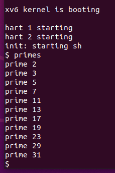

# 1. Boot xv6 
[项目链接:https://github.com/jaychou729/2024OS-xv6](https://github.com/jaychou729/2024OS-xv6)
## 1.1 实验目的
启动xv6,熟悉xv6及部分重要的系统调用。

## 1.2 实验步骤
1.获取实验室的 xv6 源代码并检出 util 分支：

```bash
$ git clone git://g.csail.mit.edu/xv6-labs-2021

Cloning into 'xv6-labs-2021'...

...

$ cd xv6-labs-2021

$ git checkout util

Branch 'util' set up to track remote branch 'util' from 'origin'.

Switched to a new branch 'util'
```

2. 利用make qemu指令运行xv6：


xv6没有ps命令，但是如果输入Ctrl-p，内核会打印每个进程的信息。现在紧接着尝试输入，我们可以看到两行：一行是init，一行是sh。

3. 输入ls指令能看到内容输出，这些是使用 ls 指令列出根目录下的文件。


这些是mkfs包含在初始文件系统中的文件，大多数是我们可以运行的程序，键入ls便是运行了其中一个。

4. 在 xv6 中按 Ctrl + a ，然后按 x 即可退出 xv6 系统。


## 1.3 实验中遇到的问题和解决办法
在安装环境时遇到较多困难，通过网上查阅资料，和同学讨论等方法正确安装虚拟机等。

## 1.4 实验心得
* 通过本实验，我初步了解了 xv6 这一操作系统内核，同时也了解了 qemu 模拟器的使用方法：可以直接使用 make qemu 编译并在 qemu 中运行 xv6 。若一切正常，make 将会执行一系列的编译和链接操作，输出大量的log ，并且用 qemu 启动 xv6 系统。

* xv6 启动后，init 进程会启动一个 shell 等待用户的命令。在这个简易的 shell 中，可以使用 ls 指令列出根目录下的文件。

* 若要结束运行 xv6 并终止 qemu，需在键盘上同时按下 Ctrl+A 键，然后按下 X 键，即可终止 qemu 的运行。

# 2. Sleep
## 2.1 实验目的
实现`xv6`的`UNIX`程序`sleep`：`sleep`应该使当前进程暂停用户指定的时钟周期数，其中`tick`计时数是`xv6`内核定义的时间概念，即定时器芯片两次中断之间的时间。解决方案应该在文件`user/sleep.c`中。 

在开始编码之前，阅读`xv6 book`的第1章，并查看`user/`中的其他程序（例如`user/echo.c`、`user/grep.c`和`user/rm.c`），了解如何获取传递命令行参数给程序。

在命令行中，您可以运行以下命令来打开文件并查看其内容：`$ vim user/echo.c` 可以使用任何文本编辑器打开文件，例如 Vim、Nano、Gedit 等。在 Vim 编辑器中打开文件后，要退出并返回终端命令行界面，可以按照以下步骤操作：

如果您处于编辑模式（`Insert Mode`），请按下 `Esc` 键，以确保切换到正常模式（`Normal Mode`）。

在正常模式下，输入冒号（`:`）字符，会在命令行底部出现一个冒号提示符。

输入` :q`，然后按下回车键，执行退出命令。

如果您对文件进行了修改并希望保存更改，输入` :wq` 以保存更改。

此外，还可以使用` cat` 命令来显示文件的内容。例如，运行以下命令来查看文件内容：`cat user/echo.c cat `命令会将文件的内容直接输出到终端。

使用` less `命令：`less `命令是一个分页查看器，用于逐页查看文件内容（使用空格键向下翻页，使用 `b `键向上翻页，按下 `q` 键退出）。例如，运行以下命令来查看文件内容：`less user/echo.c`

## 2.2 实验步骤
使用系统调用sleep：实现的源码放置在 `user/sleep.c`。

1. 参阅kernel/sysproc.c以获取实现sleep系统调用的xv6内核代码。
2. user/user.h提供了sleep的声明以便其他程序调用：


3. 仿照user/echo.c的写法，写user/sleep.c文件，确保main函数调用exit()以退出程序；


4. 将sleep程序添加到Makefile中的UPROGS中即可运行；


5. 保存后在终端里执行make qemu编译运行xv6。

6. 在命令行中输入 sleep + 参数(例如5)，则系统会在5个时钟周期后重新出现命令行；


7. 如果命令行参数不等于2个，则打印错误信息：


8. 在终端里运行 ./grade-lab-util sleep 可进行评分：


## 2.3 实验中遇到的问题和解决办法
* 为了使用 `sleep` 函数，用户程序需要包含一系列相关的头文件，在确定所需头文件的过程中，我通过阅读 `user/user.h` 等头文件并结合控制台报错信息来确定需要在 `main` 函数中使用的头文件，最终成功调用 `sleep` 函数。
* 程序在输入了不正确的参数时崩溃,为此,在`main`函数中，判断参数数量是否等于2，如果不是,则表示输入参数数量不正确，返回`Usage: sleep time`。

## 2.4 实验心得
* 实验时需要明白程序的功能，并且阅读该程序相关的依赖文件，理清参数传递和头文件依赖关系等，避免参数传递出错或缺少头文件等。

* 在编译并运行 sleep 程序之前，我们除了需要正确配置 xv6 环境之外，还需要及时让系统支持并正确实现 sleep 系统调用，否则程序将无法被系统调用并运行测试。

* 使用循环和条件语句进行参数的检查和处理,避免参数出错。

# 3.pingpong
## 3.1 实验目的
编写一个使用UNIX系统调用的程序, 在两个进程之间“ping-pong”一个字节，使用两个管道，每个方向一个。父进程应该向子进程发送一个字节;子进程应该打印“: received ping”，其中是进程ID，并在管道中写入字节发送给父进程，然后退出;父级应该从读取从子进程而来的字节，打印“: received pong”，然后退出。解决方案应该在文件`user/pingpong.c`中。

## 3.2 实验步骤
使用系统调用：

* 使用pipe来创造管道;

* 使用fork创建子进程;

* 使用read从管道中读取数据，并且使用write向管道中写入数据;

* 使用getpid获取调用进程的pid。
1. 编写 pingpong.c 的代码程序;


2. 将pingpong程序添加到Makefile中的UPROGS中即可运行；


3. 保存后在终端里执行`make qemu`编译运行`xv6`；

4. 在命令行中输入`pingpong`，出现 :


5. 在终端里运行` ./grade-lab-util pingpong `可进行评分：


## 3.3 实验中遇到的问题和解决方法
在实验中，有这么一段要求: **父进程向子进程发送一个字节，随后子进程打印": received ping"，将pipe字节写如入父进程后退出，父进程再从子进程读取字节，打印": received pong"后退出。** 起初我因为忽视了这一段要求中的逻辑而导致程序编写不尽完善，这其实对于父子进程的先后逻辑关系做出了要求。因此我使用了一个 wait() 函数，在父进程中用于等待子进程的结束，并获取子进程的退出状态。通过这样一种同步机制来确保父进程在子进程完成之后继续执行。

如果在父进程中不使用 wait() 函数，尽管本次的测试结果与不使用wait() 函数的结果相一致，但父进程可能会在子进程执行完成之前继续执行自己的代码。这可能会导致父进程在子进程还没有完成时就退出，从而使子进程成为孤儿进程（没有父进程的进程）。此外，没有正确等待子进程完成的父进程可能无法获取子进程的退出状态，也无法做进一步的处理。

## 实验心得
* 进程间通信的重要性：本次实验让我认识到进程间通信在多进程编程中的重要性。使用管道作为通信机制，可以在父进程和子进程之间传递数据，实现数据的共享和交换。
* 进程同步的关键：实现正确的进程同步是实验中的关键。通过适当的管道读写操作和进程等待机制（如使用 wait() 函数），我成功实现了父进程和子进程的同步，确保了数据的正确交换和打印顺序。
* 熟悉管道的使用：通过编写 pingpong 程序，我更加熟悉了管道的使用。我学会了创建管道、通过文件描述符进行读写操作，以及如何关闭管道的读写端。
* 父子进程关系的理解：通过观察和分析父进程和子进程的输出顺序，我对父子进程之间的关系有了更深入的理解。我了解到子进程是由父进程派生出来的，它们共享某些资源，并在不同的代码路径中执行。
* 调试和错误处理的重要性：在实验过程中，我遇到了一些编程错误和逻辑问题。通过仔细分析错误信息、调试和追踪程序执行流程，我能够及时发现问题并进行修复。这个过程提醒我在编程中注重错误处理和调试能力的重要性。

# 4 primes
## 4.1 实验目的
使用管道编写一个基本筛选器的并发版本, 将 2 至 35 中的素数筛选出来。想法来自于 Unix 管道的发明者 Doug McIlroy。学习使用pipe和fork来设置管道。第一个进程将数字2到35输入管道。对于每个素数创建一个进程，该进程通过一个管道从左边的邻居读取数据，并通过另一个管道向右边的邻居写入数据。由于xv6的文件描述符和进程数量有限，第一个进程可以在35处停止。
解决方案位于`user/primes.c` 中。

## 4.2 实验步骤
实现的源码放置在 `user/primes.c` 。

创建父进程，父进程将数字2到35输入管道，在需要时创建管道中的进程。

对于2-35中的每个素数创建一个进程，进程之间需要进行数据传递：该进程通过一个管道从左边的父进程读取数据，并通过另一个管道向右边子进程写入数据。

对于每一个生成的进程而言，当前进程最顶部的数即为素数；对每个进程中剩下的数进行检查，如果是素数则保留并写入下一进程，如果不是素数则跳过。

完成数据传递或更新时，需要及时关闭一个进程不需要的文件描述符（防止程序在父进程到达35之前耗尽xv6的资源）。当管道的写入端关闭时， read 函数返回 0 。

在数据传递的过程中，父进程需要等待子进程的结束，并回收共享的资源和数据等，即一旦第一个进程到达35，它应该等待直到整个管道终止。因此，主primes进程应该在所有输出都打印完毕，并且所有其他 primes 进程都退出后才退出。


1.控制台输入`vim user/primes.c`编写程序

2.将 primes 程序添加到`Makefile`中的`UPROGS`中即可运行；


3.保存后在终端里执行`make qemu`编译运行xv6；

4.在命令行中输入`primes`，出现 :


5.在终端里运行 `./grade-lab-util primes` 可进行评分：


## 4.3 实验中遇到的问题和解决办法
起初父子进程的逻辑处理和数据传递让我感到疑惑，后来我对`fork()` 函数系统调用进行了深入理解：它用于创建一个新的进程（子进程）作为当前进程（父进程）的副本，子进程会继承父进程的代码、数据、堆栈和文件描述符等资源的副本。子进程和父进程在 `fork()` 调用点之后的代码是独立执行的，并且拥有各自独立的地址空间。因此，父进程和子进程可以在 `fork()` 后继续执行不同的逻辑，实现并行或分支的程序控制流程。因此数据如果要实现传递，则可以在`fork()`判定为子进程的分支上进行数据“交换”，将子变为下一级的父，从而实现了数据传递。从中我解决了程序的逻辑问题，而且更加理解了父子进程的关系，以及父子进程之间的相对关系。

## 4.4 实验心得
* 通过这个实验，实现了⼀个简单的质数筛选器。通过使用管道和递归调用，每个子进程将负责筛选出下⼀个质数，并将剩余的数字传递给下⼀个子进程。
* 实现过程中，需要维护读端和写端的管道，不断读取上一个进程写入管道的内容，并在 合适的条件下生成子进程并将其它数字写入管道。
* 加深了对fork系统调用的理解:子进程和父进程在 `fork()` 调用点之后的代码是独立执行的，并且拥有各自独立的地址空间。因此，父进程和子进程可以在 `fork()` 后继续执行不同的逻辑，实现并行或分支的程序控制流程。因此数据如果要实现传递，则可以在`fork()`判定为子进程的分支上进行数据“交换”，将子变为下一级的父，从而实现了数据传递。

# 5. find 
## 5.1 实验目的
学习并编写一个简单版本的UNIX查找程序：程序应当实现查找目录树中带有特定名称的所有文件。解决方案位于文件`user/find`.c中。

* 理解文件系统中目录和文件的基本概念和组织结构。
* 熟悉在 xv6 操作系统中使用系统调用和文件系统接口进行文件查找操作。
* 应用递归算法实现在目录树中查找特定文件。

## 5.2 实验步骤
实现的源码放置在 `user/find.c`。

查看`user/ls.c`以了解如何读取目录。 `user/ls.c`中包含一个`fmtname` 函数，用于格式化文件的名称。它通过查找路径中最后一个 '/' 后的第一个字符来获取文件的名称部分。如果名称的长度大于等于 `DIRSIZ`，则直接返回名称。否则，将名称拷贝到一个静态字符数组 `buf` 中，并用空格填充剩余的空间，保证输出的名称长度为 `DIRSIZ`。

1. 控制台输入`vim user/find.c`编写程序

2. 将 find 程序添加到`Makefile`中的`UPROGS`中即可运行


3. 保存后在终端里执行`make qemu`编译运行xv6；

4. 在命令行中输入以下命令 :

    `mkdir`为创建文件；

    `echo`为直接将数据写入文件，若文件存在则直接写入，若不存在的话新建并写入。


5. 在终端里运行` ./grade-lab-util find `可进行评分：


## 5.3 实验中遇到的问题和解决办法
实验中，我参考了目录相关操作的程序的写法，但在参考的基础上编写`find`函数的过程中出现了不少问题：

在 `find` 函数的编写过程中，我参考了`ls.c`中的`ls`函数的写法，而`ls.c`主要用于列出指定路径下的文件和目录信息，因此其结果的输出格式与本实验需求不同，这个问题起初我并未注意到。
此外，`ls.c`的输入仅仅需要一个文件地址参数，而文件查找需要路径`path`和查找文件名`name`两个参数，如上述测试使用了`find . b`和`find a b`，都提供了两个参数，因此函数的输入也需要做出相应的修改
`ls.c`程序只能提供基本的文件和目录信息，并不包含递归遍历子目录的功能。因此如果我不对 `find` 函数进行递归遍历，它只能查找指定目录下的直接子文件和子目录，而无法继续向下递归地查找子目录中的文件，这也会导致我在测试时无法得到全面的查找结果。

## 5.4 实验心得
* 通过这个实验，深入理解了文件系统中目录和文件的关系，以及如何通过系统调用和文件系统接口来访问和操作文件。

* 通过这个实验，学会了使用递归算法实现对目录树的深度遍历，以便能够在整个目录结构中查找符合条件的文件。

# 6 xargs

## 6.1 实验目的
编写一个UNIX xargs程序的简单版本：从标准输入中读取行，并为每一行运行一个命令，将行作为参数提供给命令。解决方案位于文件`user/xargs.c`中。

## 6.2 实验步骤

实现的源码放置在 `user/xargs.c`。

通过示例理解xarg的工作原理：

对字符串进行处理，| 之前的结果会在缓冲流中。


1. 控制台输入`vim user/xargs.c`编写程序

2. 将 xargs 程序添加到`Makefile`中的 UPROGS 中即可运行；

3. 保存后在终端里执行`make qemu`编译运行xv6；

4. 在命令行中输入以下命令` :xargstest.sh`


5. 在终端里运行 `./grade-lab-util xargs `可进行评分：


## 6.3 实验中遇到的问题和解决办法

1. `make qemu`编译运行xv6输入`xargstest.sh`结果不符。运行中需要注意，对文件系统的修改会在运行 `qemu` 时持续存在；要获得一个干净的文件系统，运行 `make clean`，然后再运行 `make qemu`。

2.  子进程执行命令时没有对执行结果进行处理。当前代码在创建子进程后，调⽤了 `exec` 函数执行命令，但没有对命令执行结果进行处理。可以使用 `wait` 函数等待子进程执行完毕，并检查执行结果。

## 6.4 实验心得
* 参数处理：实验要求将输入按照空格拆分为多个参数，并将它们作为命令行参数传递给外部命令。我学会了如何处理命令行中的输入字符串，跳过空格，并将参数存储在适当的数据结构中。
* 外部命令执行：通过调用exec函数执行外部命令，我深入了解了进程创建和替换的过程。了解了如何在子进程中执行外部程序，并将程序路径和参数传递给exec函数。
* 错误处理：在编写实验代码时，我学会了处理错误情况并进行适当的错误报告。例如，当参数个数超过限制或无法执行外部命令时，我通过输出错误信息和退出程序来处理这些情况。

## 实验检验得分
