# mmap

[项目链接:https://github.com/jaychou729/2024OS-xv6](https://github.com/jaychou729/2024OS-xv6)

## 1.1 实验目的
本次实验旨在向 `xv6` 操作系统添加 `mmap` 和 `munmap` 系统调用，实现对进程地址空间的详细控制。通过实现这两个系统调用，我们可以实现内存映射文件的功能，包括共享内存、将文件映射到进程地址空间等。这有助于理解虚拟内存管理和页面错误处理的机制。

## 1.2 实验步骤

切换到 `mmap` 分支：
```bash
git fetch 
git checkout mmap 
make clean
```

1. 在 `Makefile` 中添加 `$U/_mmaptest`

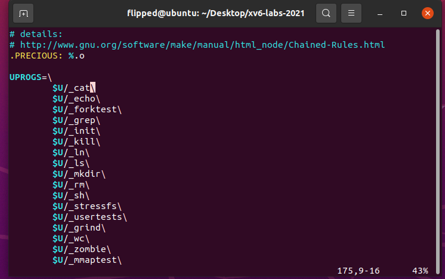

2. 添加有关 `mmap` 和 `munmap` 系统调用的定义声明：

`kernel/syscall.h`：

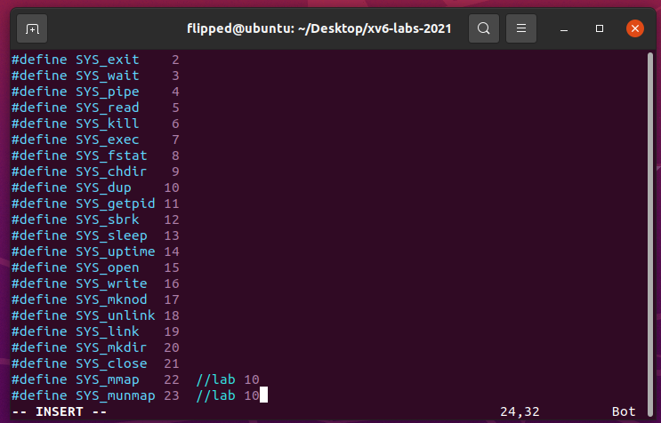

`kernel/syscall.c`：

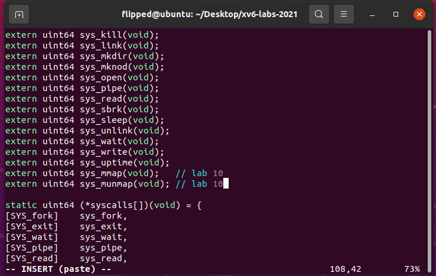

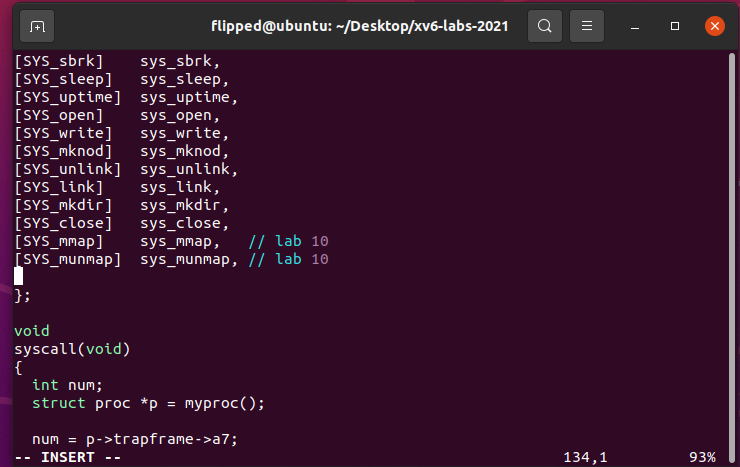

`user/usys.pl`：

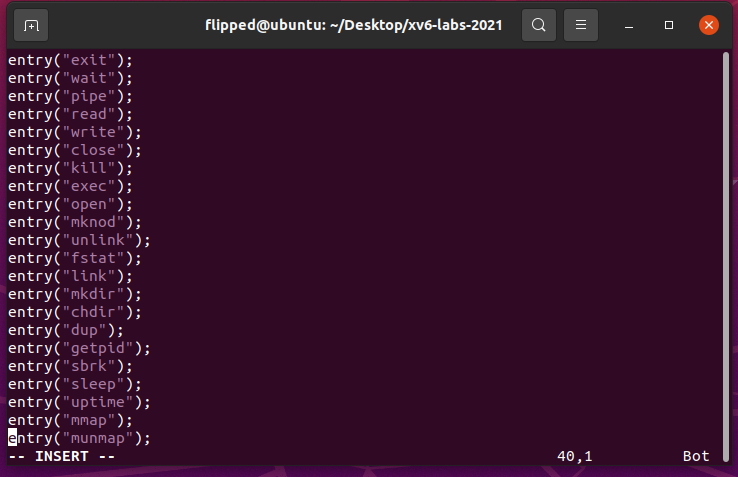

`user/user.h`：

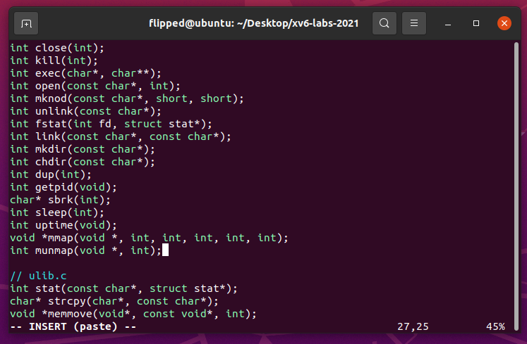

`kernel/defs.h`:

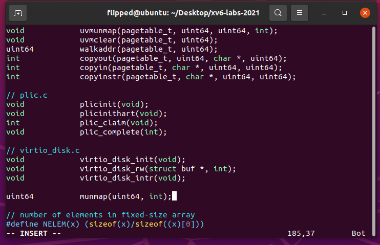

2. 在 `kernel/proc.h` 中定义 `struct vma` 结构体。同时在 `struct proc` 结构体中定义相关字段。

根据实验指导的提示，对于每个进程都使用一个 `VMA` 的数组来记录映射的内存。此处定义了 `MAXVMA` 表示 `VMA` 数组的大小，并在 `struct proc` 结构体中定义了` vma` 数组，又因为 `VMA` 是进程的私有字段，因此对于 `xv6` 的进程单用户线程的系统，访问 `VMA` 无需加锁。

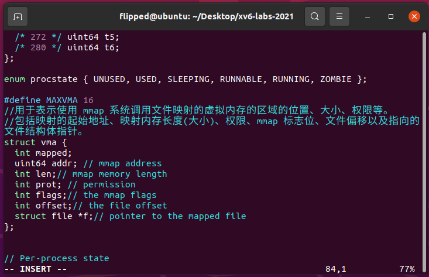

3. 在 `kernel/sysfile.c` 中实现系统调用 `sys_mmap()`，找到进程地址空间中未使用的区域，用于映射文件，并将 VMA 添加到进程的映射区域表中。`VMA` 应包含指向要映射文件的 `struct file` 的指针。确保在 `mmap` 中增加文件的引用计数，以防止文件在关闭时被删除：

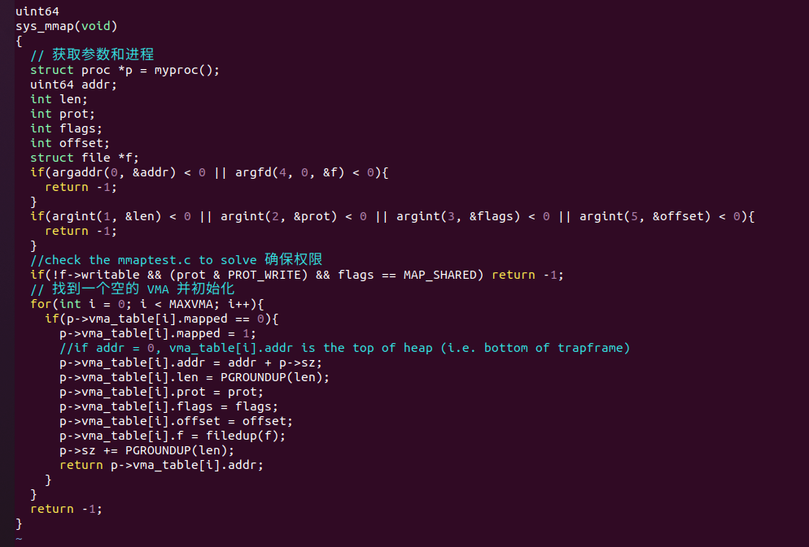

从用户传递的参数中提取信息，`len` 和 `offset` 参数使用 `int` 类型。
进行参数检查，`flag`s 参数只能为 `MAP_SHARED` 或 `MAP_PRIVATE`，检查权限和偏移量的合法性。
从当前进程的 `VMA` 数组中分配一个` VMA` 结构。
记录本次 `mmap` 的参数到分配的 `VMA` 结构中，在 `kernel/memlayout.h` 中定义 `MMAPMINADDR` 宏定义, 用于表示 `mmap` 可以用于映射的最低地址。为了确定映射地址，找到已映射内存的最高地址，向上对齐以确定新映射地址。若映射的地址空间会覆盖 `TRAPFRAME `则会报错。
在 `VMA` 结构中记录映射的地址和长度，使用 `Lazy allocation`，实际内存页面在陷阱处理页面错误时分配。
记录其他参数到` VMA` 结构中，对于文件指针，使用 `filedup() `增加引用计数。
返回分配的地址，失败则返回 -1。

4. 修改` kernel/trap.c `中的 `usertrap()` 函数，处理页错误（`Page Fault`）情况。

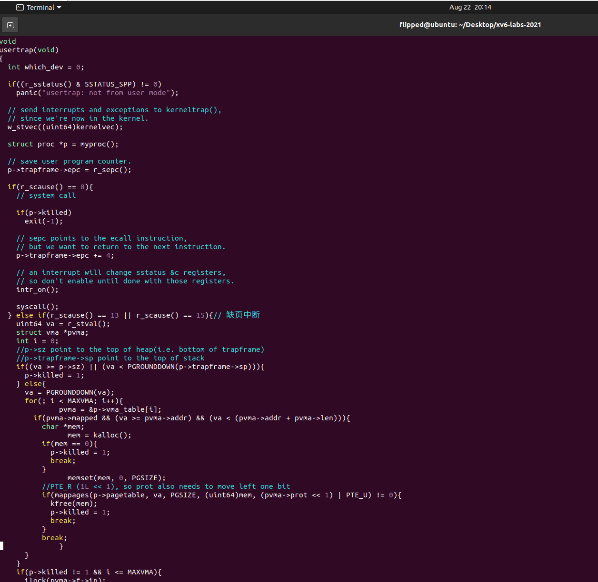

由于在 `sys_mmap()` 中对文件映射的内存采用的是` Lazy allocation`，在访问未加载界面时，会产生一个缺页中断。因此需要对访问文件映射内存产生的 `page fault `进行处理。当在 `mmap` 映射的区域发生页面错误时，分配一个物理内存页，从相关文件中读取 4096 字节到该页面，并将其映射到用户地址空间。

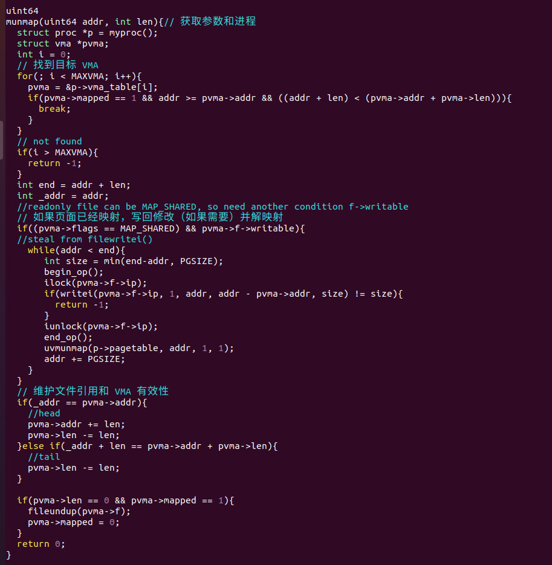

根据 `r_scause()` 值，检查是否发生页错误，可能的值为 13 和 15。
在当前进程的 `VMA` 数组中查找对应的 `VMA` 结构，比较虚拟地址 `va` 和` pvma->addr + pvma->len`。
如果找到匹配的 `VMA`，继续处理，否则忽略该页错误。
对于存储错误（`Store Page Fault`），进行特殊处理，设置脏页标志位 `PTE_D`。
执行惰性分配，使用 `kalloc()` 分配物理页，并使用 `memset() `清空物理页。
使用 `readi()` 从文件中读取数据到物理页，大小为` PGSIZE`，对文件` inode `进行加锁。
根据 `VMA` 记录的权限参数将 `PTE` 权限标志位设置为对应的读、写、执行权限。
使用 `mappages()` 将物理页映射到用户进程的虚拟地址。

5. 在` kernel/sysfile.c `中实现系统调用 `munmap()`，找到要取消映射的地址范围的 `VMA`，并取消映射指定的页面。如果 `munmap` 移除了前一个 `mmap` 的所有页面，则应减少相应的 `struct file` 的引用计数。如果一个页面被修改且文件是 `MAP_SHARED` 映射，则将修改的页面写回文件：

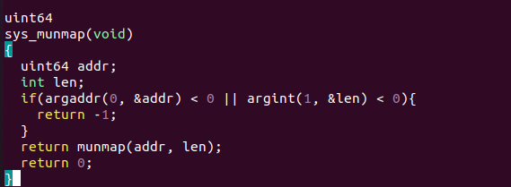

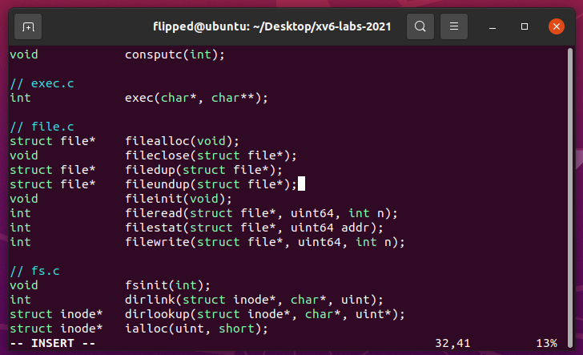

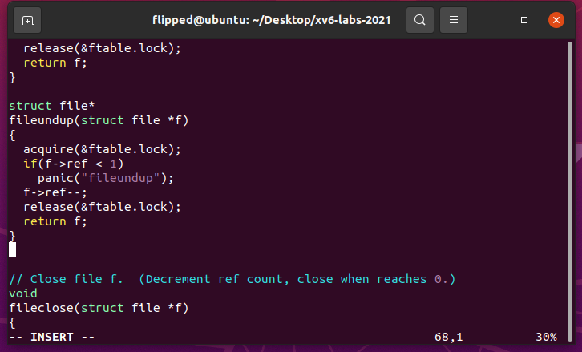

提取参数 `addr` 和 `length`。
检查参数，确保 `length` 非负，`addr` 是 `PGSIZE` 的整数倍。
根据 `addr` 和 `length` 找到对应的 `VMA` 结构体，未找到则返回失败。
若 `length` 为 0，直接返回成功。
判断 `VMA` 的标志位，若有 `MAP_SHARED`，则需要将修改的页面写回文件。
使用脏页标志位 `PTE_D` 判断哪些页面需要写回，设置为脏页后需要写入文件。
对于写回文件的大小，通常为 `PGSIZE`，但要考虑 `len` 可能不为 `PGSIZE` 整倍数。
使用类似于 `filewrite()` 的方法，分批次将修改写回文件，受日志块大小影响。
写回文件后，使用 `uvmunmap()` 取消用户页表中的映射，采用向上取整的取消映射方法。
更新 `VMA` 结构体，若取消的是整个文件映射内存区域，清空该 `VMA`。

6. 修改 `kernel/proc.c` 中的 `exit()` 函数和`fork()` 函数，复制、删除当前进程的 `VMA` 字段。

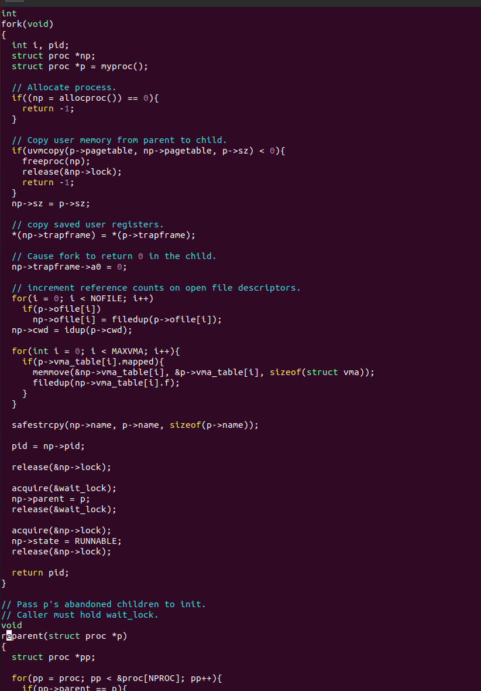

在进程退出时，需要像 `munmap()` 一样对文件映射部分内存进行取消映射。因此添加的代码与` munmap() `中部分基本系统，区别在于需要遍历 `VMA` 数组对所有文件映射内存进行整个部分的映射取消。

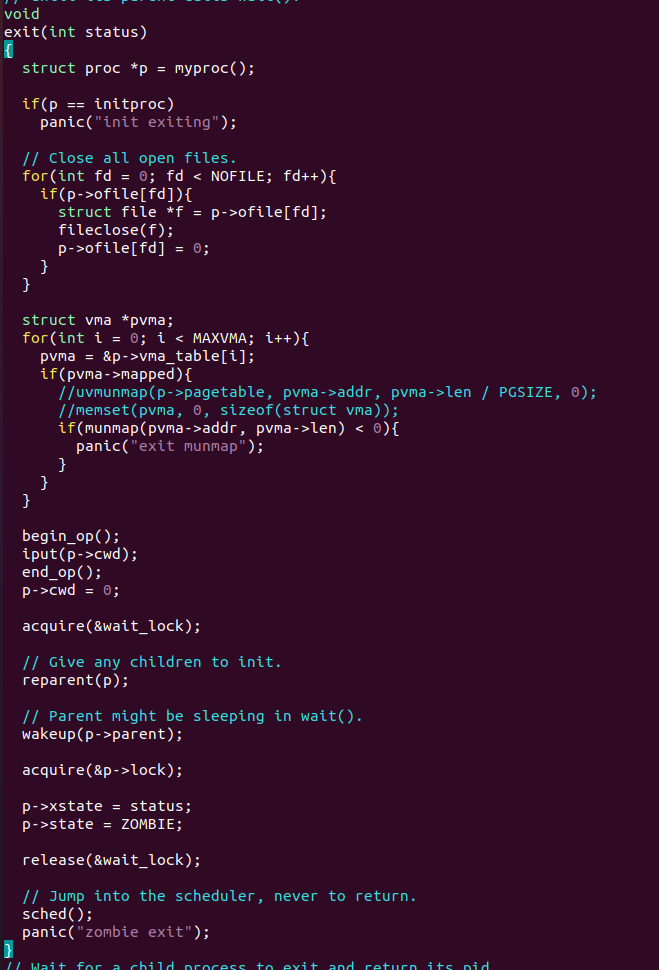

修改 `fork`，以确保子进程与父进程具有相同的映射区域。不要忘记增加 VMA 的 `struct file` 的引用计数。在子进程的页面错误处理程序中，可以分配新的物理页面，而不是与父进程共享页面。

8. 更改`kernel/vm.c`修改`uvmcopy()`函数中

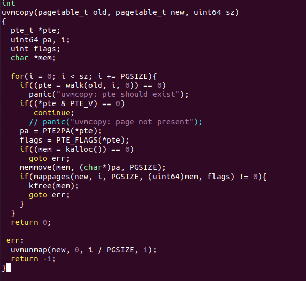

9. 利用`make qemu`指令运行`xv6`：

10. 在命令行中输入`mmaptest`:

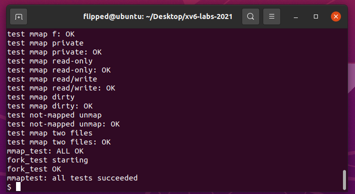

## 1.3 实验中遇到的问题和解决办法

1. 在测试过程中出现：

```bash
$ mmaptest
mmap_test starting
test mmap f
test mmap f: OK
test mmap private
test mmap private: OK
test mmap read-only
test mmap read-only: OK
test mmap read/write
test mmap read/write: OK
test mmap dirty
test mmap dirty: OK
test not-mapped unmap
test not-mapped unmap: OK
test mmap two files
test mmap two files: OK
mmap_test: ALL OK
fork_test starting
panic: uvmunmap: not mapped
```

更改`kernel/vm.c`修改`uvmumap`()函数，`(*pte & PTE_V) == 0`时继续执行而不报错。
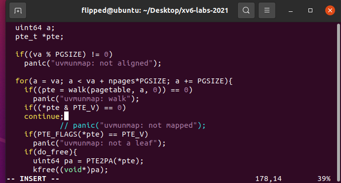

`uvmsetdirtywrite()` 函数的编写上，我们希望执行一次页表项的查找和更新操作。`walk` 函数用于查找虚拟地址对应的页表项，然后我们知道`PTE_D` 标志位用于跟踪页面是否被修改过。在页发生写入操作时，硬件会将此标志位置位，表示页面已被修改。但是我不能仅仅以此作为更新标志，我还必须考虑`PTE_W` 标志位，它表示页面是否可写。如果页面是只读的，这个标志位将不会被设置。在发生写操作时，如果页面不可写，将会触发页故障并进行相应处理。所以我将它修改成：使用按位或操作将` PTE_D `和 `PTE_W` 标志位设置在该页表项中，这将标识此页为脏页并且可写。

## 1.4 实验心得
通过本实验，我深入了解了虚拟内存管理、页表操作以及文件系统的交互，同时也熟悉了在操作系统中实现系统调用的步骤和原理。

我成功实现了 `sys_mmap()` 系统调用，特别是添加了对映射权限的检查，确保只有可写的文件能够使用 `MAP_SHARED` 形式映射。在实现中，我使用了 `Lazy Allocation` 的思想，仅在页面发生缺页异常时才进行实际的物理内存分配和数据读取。

此外，我还学会了通过合理的标志位设置，实现对脏页的识别和处理，以及根据标志位的设置决定是否写回文件。我还意识到，在实现操作系统的功能时，合理的数据结构和算法设计对于实现的可靠性和性能至关重要。

同时，这一次实验是比较综合性的实验，我能够感受到操作系统的各个部分之间的紧密配合与联系，比如以下的例子：

页表与虚拟内存管理： 实验中涉及到的 `Lazy Allocation`（延迟分配）机制是通过页表来实现的。在进行文件映射时，并不会立即分配物理内存，而是在页面首次访问时才触发物理内存的分配和内容填充。此间，页表记录了虚拟地址与物理地址之间的映射关系，`Lazy Allocation` 的实现需要在虚拟地址首次访问时，操作系统根据页表的映射关系将物理内存进行分配。
系统调用与用户态交互： 在实验中，为了支持 `mmap` 和 `munmap` 系统调用，需要修改操作系统的系统调用接口。这涉及到用户态和内核态的切换，以及参数的传递和返回值的获取。系统调用提供了用户程序与操作系统内核之间的接口，允许用户程序请求操作系统的服务。在实验中，`mmap` 和 `munmap` 系统调用的实现需要正确解析用户程序传递的参数，然后在内核中执行相应的操作，如分配物理内存、建立页表映射等。
文件系统与虚拟内存结合： `mmap` 系统调用的核心是将文件内容映射到虚拟内存中。这涉及到文件系统和虚拟内存的结合。操作系统需要维护文件的相关信息，如打开的文件描述符，然后通过文件描述符来获取文件内容，并将其映射到虚拟内存的合适位置。这种结合使得用户程序可以直接访问文件内容，而无需显式的读写操作。
实验通过操作系统的各个组成部分之间的紧密联系与配合，这才得以实现一种高效的文件映射机制，展示了操作系统内部不同部分的相互依赖和协作。从页表到文件系统，再到系统调用和虚拟内存管理，每个部分都为实验目标的实现提供了关键支持。这种综合性的设计和实现让我感慨不已，这样精巧的设计使得操作系统能够更好地支持用户程序的需求，也提高了系统的性能和可用性。