# 1. System call tracing
 
## 1.1 实验目的

追踪系统调用：了解系统调用跟踪功能的实现。创建一个新的跟踪系统调用（`trace system call`），用于控制跟踪操作，追踪用户程序使用系统调用的情况。

该系统调用应接受一个整数参数 "mask"，其中的位数表示要跟踪的系统调用。例如，要跟踪 `fork` 系统调用，程序应调用 `trace(1 << SYS_fork)`，其中` SYS_fork `是来自` kernel/syscall.h `的系统调用号。该进程调用过 `trace(1 << SYS_fork)` 后，如果该进程后续调用了`fork` 系统调用，调用 `fork` 时内核则会打印形如`<pid>: syscall fork ->  <ret_value>` 的信息。

需要修改` xv6 `内核以便在每个系统调用即将返回时打印一行输出，输出行应包含进程`ID`、系统调用名称和返回值，不需要打印系统调用的参数。`trace` 系统调用应启用调用它的进程以及其后续 `fork` 出的所有子进程的跟踪，但不应影响其他进程。

## 1.2 实验步骤
Lab2中向 XV6 添加一些新的系统调用，并展示一些 xv6 内核的内部结构。

系统调用的用户空间代码在 `user/user.h` 和 `user/usys.pl` 中。

内核空间代码在 `kernel/syscall.h` 和 `kernel/syscall.c` 中。

与进程相关的代码在 `kernel/proc.h` 和 `kernel/proc.c` 中。

切换到 `syscall` 分支：

```bash
  $ git fetch
  $ git checkout syscall
  $ make clean
  ```

  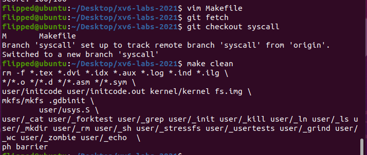

 1. 在 `Makefile` 的` UPROGS `环境变量中添加` $U/_trace`

  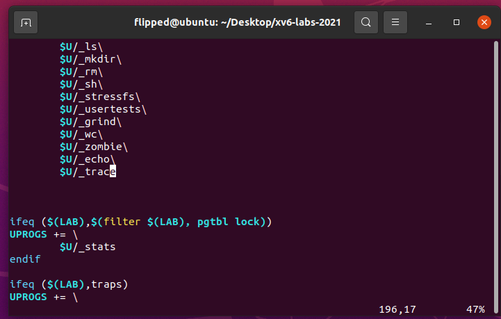

 2. 添加系统调用的声明和存根：

在 `user/user.h` 中添加` trace `系统调用原型：(作为`trace `系统调用在用户态的入口)

```c
int trace(int);	// lab 2.1
```

 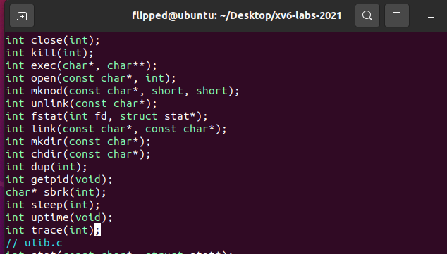

 在` user/usys.pl `脚本中添加` trace `对应的` entry`:(生成调用` trace(int)` 入口时在用户态执行的汇编代码)

```python
entry("trace"); # lab 2.1
```

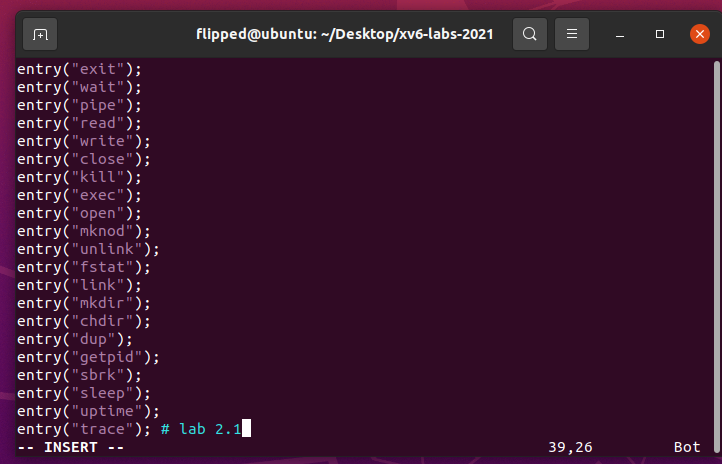

在 `kernel/syscall.h` 中添加 `trace` 的系统调用号(为`trace` 分配一个系统调用的编号)

```c
#define SYS_trace 22	// lab 2.1
```

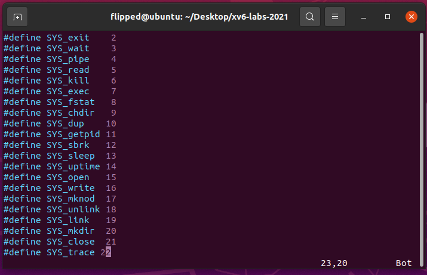

3.编写` trace `的系统调用函数

结构体` struct proc `的定义在` kernel/proc.h `中，该结构体记录着进程的转态。需要为` trace `系统调用添加一个变量` tracemask `来记录其参数。因为` trace `只会在本进程发挥作用，所以` tracemask `应该作为进程的私有变量。

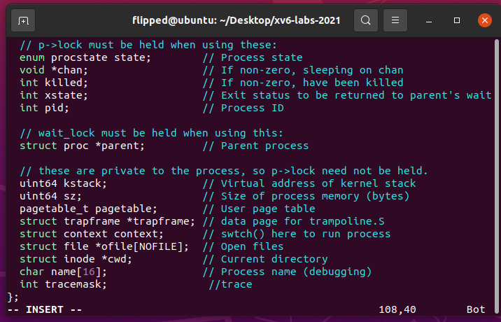

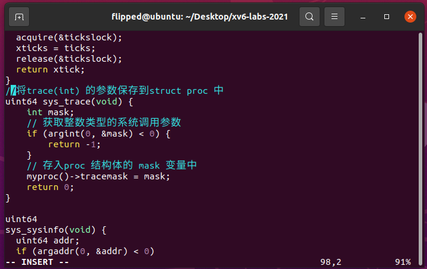

4.修改` fork() `函数，将父进程的跟踪掩码复制到子进程。

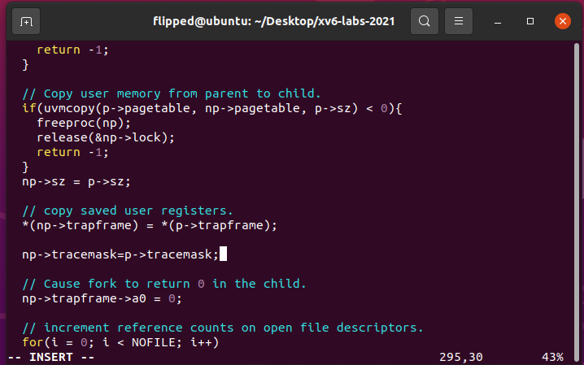

5.在` syscall.c `中添加函数引用

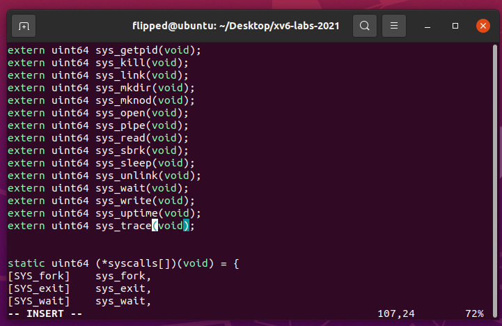

在` syscall.c `中添加一个`syscall_names`数组，使用系统调用名称来索引。

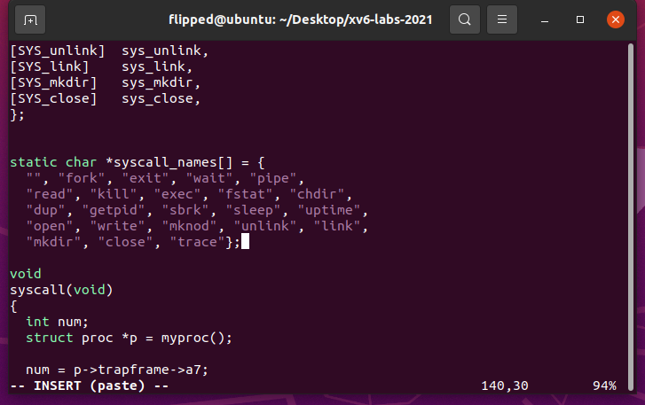

修改`syscall.c`中的`syscall()`函数以打印跟踪输出。

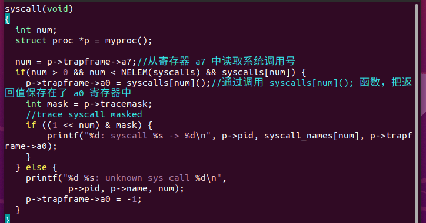

添加` syscalls `函数指针的对应关系


6.保存后在终端里执行`make qemu`编译运行xv6；

在命令行中输入`trace 32 grep hello README`，该语句就是一个进程，包含了多个系统函数，但我们只跟踪`read()`:（其中32是`1 << SYS_read` 即` 1 << 5`）

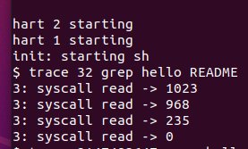

在命令行中输入`trace 2147483647 grep hello README`，该语句就是一个进程，该进程包含了多个系统函数，同时，全部调用到的系统函数我们都跟踪

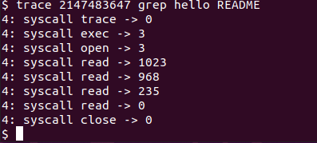

在命令行中输入`grep hello README`，程序没有被跟踪，因此没有打印跟踪输出“：


在命令行中输入`trace 2 usertests forkforkfork`，跟踪了` usertests `中 `forkforkfork` 测试的所有后代的 `fork` 系统调用：

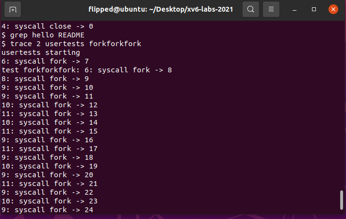

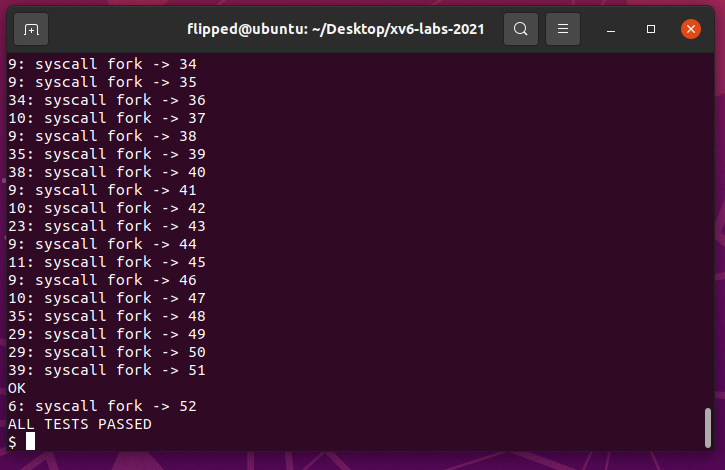

在终端里运行 `./grade-lab-syscall trace` 可进行评分：

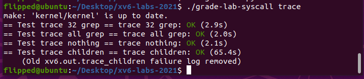

## 1.3 实验中遇到的问题和解决方法

用户态和内核态之间的数据传递： 在系统调用的实现中，需要正确地传递参数和数据，包括用户态和内核态之间的切换。起初这让我很困惑，但是我通过仔细阅读系统调用相关的文档和源代码，找到了正确使用数据传递方法，如使用合适的系统调用参数读取函数等。

以下是我总结的实验中涉及到的用户态和内核态之间的数据传递和状态切换的方面：

系统调用参数传递： 在实验中，用户程序通过调用` sys_trace `系统调用来传递一个整数参数` mask `给内核，用于指定要追踪的系统调用。用户程序通过` argint `函数将参数从用户空间传递到内核空间。
内核态与用户态切换： 当用户程序调用` sys_trace `系统调用时，会触发用户态切换到内核态。这个切换由系统调用机制完成。
数据传递和复制： 用户程序传递给内核的` tracemask `参数需要在内核中进行数据复制。当用户程序传递参数给内核时，内核需要正确地从用户空间复制数据到内核空间，以确保内核能够访问到正确的数据。
数据验证和权限检查： 在实验中，内核需要验证用户传递的 `tracemask` 参数是否合法，并确保用户程序有权限调用 `sys_trace` 系统调用。内核可以通过对` tracemask `进行合法性检查来防止恶意传递错误的参数。

`Timeout! trace children`超时:
```bash
== Test trace children == 
$ make qemu-gdb
Timeout! trace children: FAIL (30.2s) 
    ...
         9: syscall fork -> 56
         6: syscall fork -> -1
         7: syscall fork -> -1
         8: syscall fork -> -1
         qemu-system-riscv64: terminating on signal 15 from pid 5581 (make)
    MISSING '^ALL TESTS PASSED'
    QEMU output saved to xv6.out.trace_children
```
在.py文件gradelib.py中改变超时判断时间70s。

## 1.4 实验心得
* 通过本实验，我了解了如何在 xv6 内核中添加新的系统调用，如何修改进程控制块以支持跟踪掩码，并且理解了如何在内核中实现系统调用的功能。此外，我还了解了如何在用户级程序中调用新增的系统调用，并在实验中验证系统调用的正确性。

* 通过完成实验，我更深入地理解了操作系统的系统调用机制。我了解了用户空间和内核空间之间的交互方式，并学会了如何在用户程序中调用新添加的系统调用。此外，我还加深了对 xv6 内核的理解，包括系统调用的执行流程、内核数据结构和进程管理。

# 2.Sysinfo

## 2.1 实验目的
本实验添加一个系统调用`sysinfo`，用于收集有关正在运行的系统的信息。该系统调用接受一个参数：指向`struct sysinfo`结构体的指针（见`kernel/sysinfo.h`）。内核应填充该结构体的字段：`freemem`字段应设置为空闲内存的字节数，`nproc`字段应设置为状态不是UNUSED的进程数量。

提供了一个名为`sysinfotest`的测试程序；如果该程序打印出"`sysinfotest: OK`"，则表示通过此任务。

## 2.2 实验步骤

1. 在 `Makefile` 的 `UPROGS` 中添加 `$U/_sysinfotest\
`
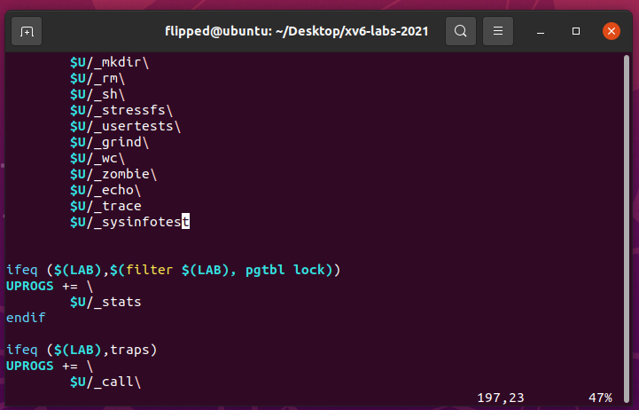

2. 添加系统调用的声明和存根：

在` user/user.h`中添加 `sysinfo()`调用原型：
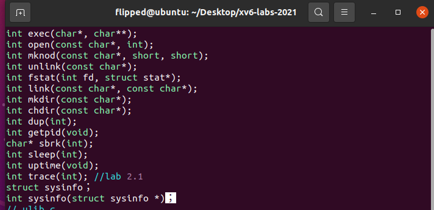

在` user/usys.pl `脚本中添加 对应的 `entry`:

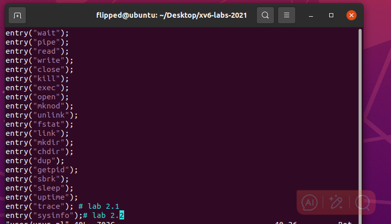

在` kernel/syscall.h `中添加` trace `的系统调用号(为`trace` 分配一个系统调用的编号)

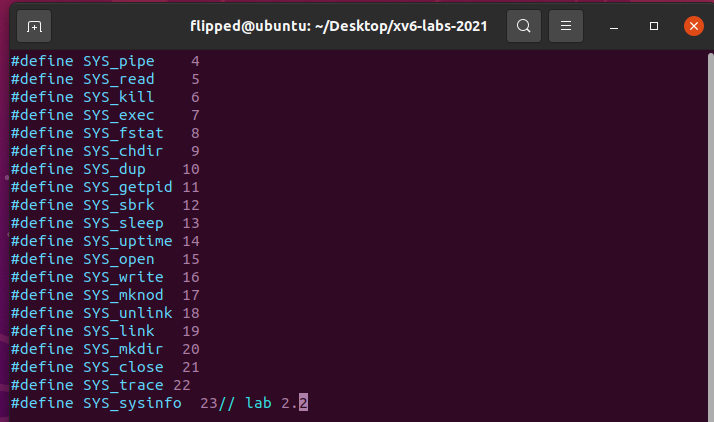

在` syscall.c `中添加函数引用
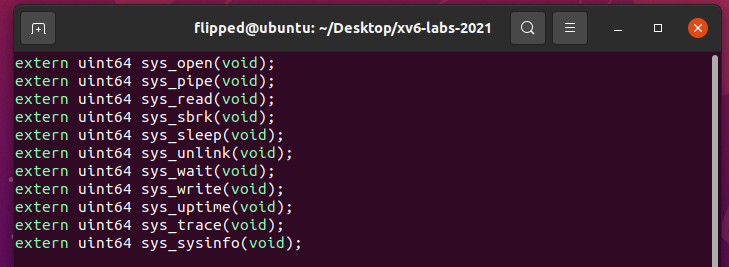

编写函数, 获得空闲内存大小:

在` kernel/kalloc.c` 实现一个函数。由于 `xv6` 管理内存空闲空间使用的是空闲链表，参照链表的结构后，只需遍历链表并计算数量，然后乘以页面大小即可。
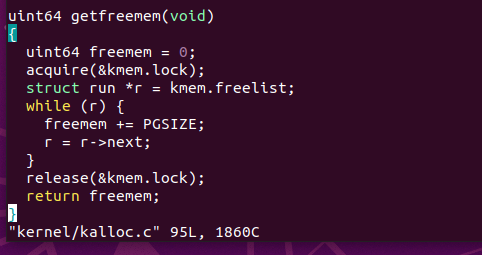

4. 编写函数, 统计空闲进程控制块的数量：

在` kernel/proc.c `实现一个函数。进程控制块是用静态数组管理的， 故而只需要用一个循环遍历该数组即可。

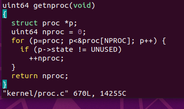

5. 在` kernel/sysproc.c `中实现的 `sys_ sysinfo(void)`
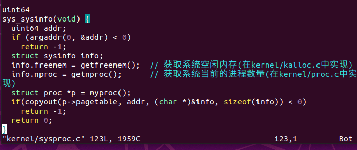
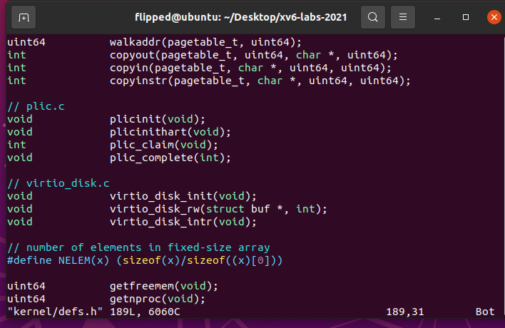

6. 保存后在终端里执行make qemu编译运行xv6；

7. 在命令行中输入`sysinfotest`:
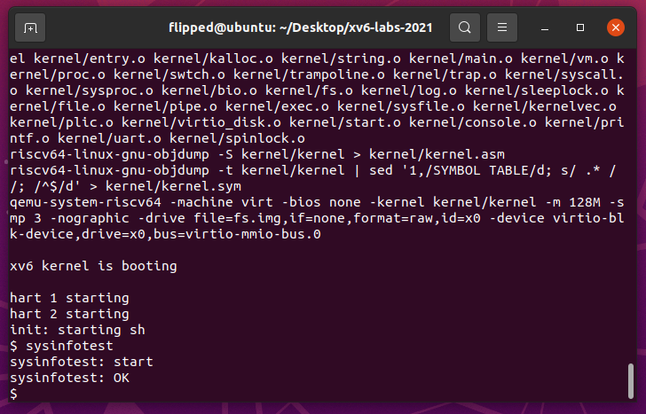

8. 在终端里运行` ./grade-lab-syscall sysinfo `可进行评分：


## 2.3 实验中遇到的问题和解决方法
本次实验的核心在于收集系统运行的信息，比如收集可用内存的数量和进程数，因此首先遇到的困难在于要如何根据现有的源码提取出可供我们利用的参数，于是我参考了`kalloc() `和 `kfree() `等几个函数，可以看到内核通过` kmem.freelist `的一个链表维护未使用的内存，但是我不能遍历获取了可用的链表节点就认为任务完成了，我一开始忽视了链表的每个结点还对应了页表大小(PGSIZE)，PGSIZE的宏定义在源码中也有提示，所以我需要最后乘上这个页表大小才是真正获得了可用内存数。

## 2.4 实验心得
通过本次实验，我成功为系统添加了一个新的系统调用 `sysinfo`，实现了收集运行系统的信息，如可用内存数、进程数等。在完成实验的过程中，我还认真了解了实现所需的几个基础数据结构，比如`kmem`链表，以及表示进程状态的字段`UNUSED`等，要实现这些能够反应系统运行信息功能，我们首先需要了解这些信息分别由什么记录，这样我们才能更有针对性地对他们做出追踪和检测，因此这也更让我深刻认识到，功能的实现要基于这个系统的基础配置和数据结构，这些信息我们可以通过查阅相关资料的文字介绍和示意图来了解，也可以对照源代码去查看已有的数据结构基础。

## 实验检验得分

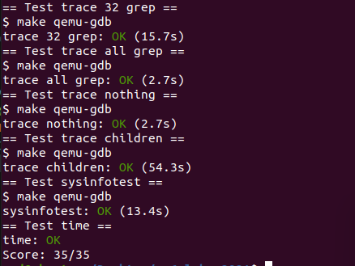


