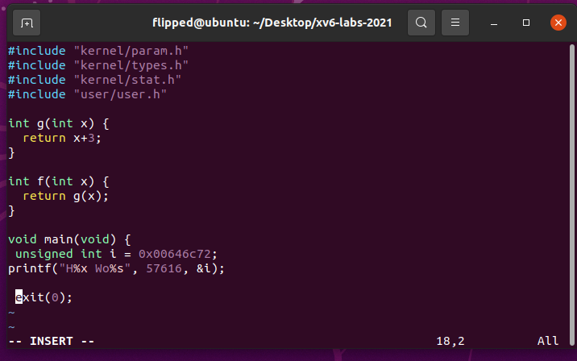

# 1. RISC-V assembly

##　1.1 实验目的

理解 RISC-V 汇编语言。

在 `xv6 repo` 中有一个文件 `user/call.c`。`make fs.img` 会对其进行编译，并生成 `user/call.asm` 中程序的可读汇编版本。

## 1.2 实验步骤

切换到` traps `分支：
```bash
git fetch 
git checkout traps 
make clean
```


1. 执行`make fs.img`编译`user/call.c`


2. 在`user/call.asm`中生成可读的汇编版本,阅读函数g、f和main的代码:


3. 请回答下列问题：

### Q1
> Which registers contain arguments to functions? For example, which register holds 13 in main's call to printf?


例如，查看`call.asm`文件中的`main`函数可知，在` main `调用` printf `时，由寄存器` a2 `保存 13。

### Q2
> Where is the call to function f in the assembly code for main? Where is the call to g? (Hint: the compiler may inline functions.)


函数 f 调用函数 g ；函数 g 使传入的参数加 3 后返回。

编译器会进行内联优化，f 被printf("%d %d\n", f(8)+1, 13) 调用，但是对应的会汇编代码却是直接将 f(8)+1 替换为 12 .这就说明编译器对这个函数调用进行了优化，所以对于 main 函数的汇编代码来说，其并没有调用函数 f 和 g ，而是在运行之前由编译器对其进行了计算。

### Q3
> At what address is the function printf located?


查阅得到其地址在 0x630。

### Q4
> What value is in the register `ra` just after the jalr to printf in main?


> 30：使用 auipc ra,0x0 将当前程序计数器 pc 的值存入 ra 中。

> 34：jalr 1536(ra) 跳转到偏移地址 printf 处，也就是 0x630 的位置。

根据 `reference1 `中的信息，在执行完这句命令之后， 寄存器 `ra` 的值设置为` pc + 4 `，也就是` return address` 返回地址 `0x38`。即`jalr `指令执行完毕之后，`ra` 的值为 `0x38`.

### Q5
> Run the following code.
```c
	unsigned int i = 0x00646c72;
	printf("H%x Wo%s", 57616, &i);
```



运行结果：打印` He110 World`。

首先，`57616` 转换为 `16` 进制为 `e110`，所以格式化描述符 `%x` 打印出了它的 `16` 进制值。

其次，如果在小端（`little-endian`）处理器中，数据`0x00646c72` 的高字节存储在内存的高位，那么从内存低位，也就是低字节开始读取，对应的` ASCII `字符为` rld`。


如果在 大端（`big-endian`）处理器中，数据 `0x00646c72` 的高字节存储在内存的低位，那么从内存低位，也就是高字节开始读取其 `ASCII` 码为` dlr`。

所以如果需要满足大端序和小端序输出相同的内容` i` ，那么在其为大端序的时候，`i` 的值应该为 `0x726c64`，这样才能保证从内存低位读取时的输出为 `rld` 。

无论 `57616 `在大端序还是小端序，它的二进制值都为 `e110` 。大端序和小端序只是改变了多字节数据在内存中的存放方式，并不改变其真正的值的大小，所以 `57616` 始终打印为二进制 `e110` 。

因此，如果在大端序，`i` 的值应该为 `0x00726c64` 才能保证与小端序输出的内容相同。且不需要改变` 57616` 的值。

### Q6
> In the following code, what is going to be printed after 'y='? (note: the answer is not a specific value.) Why does this happen?
```c
	printf("x=%d y=%d", 3);
```


因为函数的参数是通过寄存器`a1`, `a2` 等来传递。根据函数的传参规则, `y=` 后跟的值应该为寄存器 `a2` 的值。如果 `prinf` 少传递一个参数，那么其仍会从一个确定的寄存器中读取其想要的参数值，但是我们没有给出并存储这个确定的参数，所以函数将从此寄存器中获取到一个随机的不确定的值作为其参数。故而此例中，`y=`后面的值我们不能够确定，它是一个垃圾值。

## 1.3 实验心得
本次实验我进一步了解系统调用所发挥的重要作用，更清楚的认识到了系统调用的作用。

# 2. Backtrace

## 2.1 实验目的
实现一个回溯（`backtrace`）功能，用于在操作系统内核发生错误时，输出调用堆栈上的函数调用列表。这有助于调试和定位错误发生的位置。


2.2 实验步骤
1. 在 `kernel/defs.h` 中添加 `backtrace` 函数的原型`void backtrace(void)`;，以便在 `sys_sleep` 中调用该函数。


2. `GCC` 编译器将当前正在执行的函数的帧指针（`frame pointer`）存储到寄存器 s0 中。在` kernel/riscv.h` 中添加以下内联汇编函数:


3. 在` kernel/printf.c `中实现一个名为 `backtrace `的函数。这个函数的目标是通过遍历调用堆栈中的帧指针来输出保存在每个栈帧中的返回地址。

循环终止条件中，栈由高地址向低地址增长，栈底是当前页最高地址


4. 在` sys_sleep` 函数中调用` backtrace` 函数。


5. 在 `kernel/printf.c` 的 `panic()` 函数中添加对 `backtrace()` 的调用


6. 保存后在终端里执行make qemu编译运行xv6；

7. 在命令行中输入`bttest`:


8. 退出 xv6 后运行 `addr2line -e kernel/kernel` 将 `bttest` 的输出作为输入, 输出对应的调用栈函数

根据输出的源码行号找对应的源码, 发现就是` backtrace()` 函数的所有调用栈的返回地址(函数调用完后的下一代码)(`sysproc.c, syscall.c,trap.c`)

## 2.3 实验中遇到的问题和解决方法
* 帧指针的使用： 在实验中，我需要理解帧指针在调用堆栈中的作用，以及如何使用它来访问上一级函数的返回地址。

编译器会在每个堆栈帧中放置一个帧指针，用于保存调用者帧指针的地址。我需要反向跟踪并使用这些帧指针在堆栈中向上走动，并在每个堆栈帧中打印保存的返回地址。

此外，为了正确输出地址，我需要理解返回地址和堆栈帧指针之间的位置关系，通过查看课堂笔记，我了解到返回地址与堆栈帧的帧指针有固定偏移（-8），而保存的帧指针与帧指针有固定偏移（-16）。

* 循环终止条件： 在` backtrace `函数中，我需要遍历整个调用堆栈，但是起初我不清楚这个循环需要一个什么样的终止条件。后来通过学习我发现，使用 `PGROUNDDOWN` 和 `PGROUNDUP` 宏可以帮助我计算栈页的顶部和底部地址，从而确定循环终止的条件。

## 2.4 实验心得
在完成这个实验过程中，我学到了关于调用堆栈和帧指针的重要概念。通过实现和理解 `backtrace` 函数，我深入了解了在程序执行过程中函数调用和返回的机制。

首先，我意识到帧指针在调用堆栈中的作用是关键。帧指针是一个在每个堆栈帧中保存调用者帧指针的位置，它帮助我们在调用链中向上移动。通过正确使用帧指针，我能够遍历每个堆栈帧并访问其中保存的返回地址，从而实现了回溯功能。

其次，理解返回地址与帧指针的相对位置是非常重要的。根据 `RISC-V` 的调用约定，返回地址相对于帧指针有固定的偏移。通过查看课堂笔记，我能够准确计算和访问这些地址，确保了输出的正确性。

另外，解决循环终止条件的问题是实验中的一个关键点。使用 `PGROUNDDOWN` 和 `PGROUNDUP` 宏可以帮助我确定栈页的顶部和底部地址，进而确定循环何时终止。这个问题的解决让我更加自信地遍历调用堆栈。

# 3. Alarm

## 3.1 实验目的
实现定时器系统调用：向 `xv6` 内核添加周期性地为进程设置定时提醒的功能，类似于用户级的中断/异常处理程序，能够让进程在消耗一定的 CPU 时间后执行指定的函数，然后恢复执行。通过实现这个功能，我们可以为计算密集型进程限制 CPU 时间，或者为需要周期性执行某些操作的进程提供支持。

## 3.2 实验步骤
1. 在 `Makefile` 中添加`$U/_alarmtest\`，以便将 `alarmtest.c` 作为 `xv6 `用户程序编译。


2. 在 `user/user.h` 中设置正确的声明，两个系统调用的入口，分别用于设置定时器和从定时器中断处理过程中返回：


3. 更新 `user/usys.pl`（用于生成 `user/usys.S`）：在 `usys.pl` 中添加相应的用户态库函数入口：


4. 在 `syscall.h` 中声明 `sigalarm` 和 `sigreturn` 的用户态库函数：


5. 在 `syscall.c` 中添加对应的系统调用处理函数：


6. `kernel/proc.h`在` sys_sigalarm `中，将警报间隔和处理函数的指针存储在 `proc` 结构体的新字段中；`sys_sigreturn` 只返回零：


7. 为了追踪自上次调用警报处理函数以来经过了多少个时钟中断，可以在 `proc.c` 中的 `allocproc()` 函数中初始化 proc 的这些字段。


8. 在 `sysproc.c` 中实现 `sys_sigalarm` 和 `sys_sigreturn` 的内核处理逻辑。

添加一个新的系统调用 `sigalarm(interval, handler)`。如果一个应用调用了 `sigalarm(n, fn)`那么这个进程每消耗 n 个 `ticks`，内核应该确保函数 `fn` 被调用。当 `fn` 返回的时候，内核应该恢复现场，确保该进程在它刚才离开的地方继续执行。一个 `tick` 在 `xv6` 中是一个相当随意的单位时间，它取决于硬件时钟产生中断的快慢。如果一个应用调用 `sigalarm(0, 0)` ，内核应该停止产生周期性的警报调用。
在传入的`fn`执行完毕后，需要在内核态对应的 `sys_sigreturn()` 中将备份的上下文恢复，然后返回用户态。


9. 修改` kernel/trap.c` 中的 `usertrap()` 函数，实现周期性执行函数，判断是否为定时器中断的 `if` 语句块修改定时器中断发生时的行为，为每个有`sigalarm `的进程更新其已经消耗的 `ticks` 数；判断该进程已经使用的 `ticks` 数是否已经足以触发 `alarm`：


11. 在 `sysproc.c` 中增加`cpytrapframe`函数声明：


12. 保存后在终端里执行`make qemu`编译运行xv6；

13. 在命令行中输入`alarmtest`:


在 `Makefile` 中添加`$U/_usertests\`，运行 `usertests`


## 3.3 实验中遇到的问题和解决方法
理解系统调用的机制： 首先我们需要确保对系统调用的处理流程和机制有清晰的理解，包括用户态和内核态之间的切换，参数传递等。起初我设置了`alarm`的内核操作，但是遗漏了对用户层面的声明和入口设置，导致程序运行出错，不过这也让我对两态的转换有了更好地理解。
处理函数调用和恢复： 在调用处理函数后，需要确保能够正确地恢复进程的执行状态，包括保存和恢复寄存器状态等。一开始我并没有注意到，中断的时候已经在` proc->saved_trapframe `中保存了中断帧信息，从而对于如何回复中断没有头绪。后来我才发现在中断发生时保存了中断帧，其中包含了被中断的用户态代码执行时的寄存器状态，因此我们需要将它恢复回 `proc->trapframe`。

## 3.4 实验心得
通过本次实验，我对于定时中断的处理有了更深的理解。如果需要实现定时中断处理函数，这可能涉及到操作硬件定时器和设置中断处理程序，从而也加深了对中断处理机制的了解。

此外这次实验也涉及到用户和管理两态的转换，我再次巩固了如何设置声明和入口使得二者连接。除此之外，通过这一次的测试程序，我还明白，在修改内核操作的时候，应当确保不影响系统稳定性，即在实现定时中断处理功能时，要确保不会影响系统的稳定性和正常运行，确保中断处理程序能够及时返回，避免影响其他中断和系统调度。进行这样充分的测试，我们才能确保定时中断处理不会导致系统崩溃或异常。

## 4 实验检验得分
在终端中执行`make grade`


