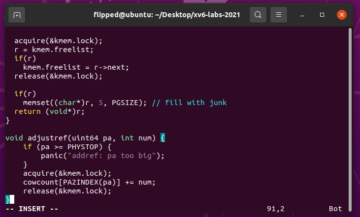
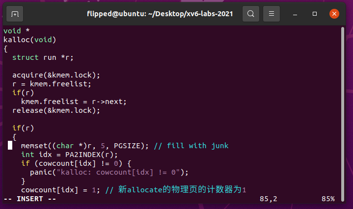

# 1. Implement copy-on write
[项目链接:https://github.com/jaychou729/2024OS-xv6](https://github.com/jaychou729/2024OS-xv6)
##　1.1 实验目的

实验的主要目的是在 `xv6` 操作系统中实现写时复制`（Copy-on-Write，COW）`的 `fork` 功能。传统的 `fork()` 系统调用会复制父进程的整个用户空间内存到子进程，而 `COW fork()` 则只复制父进程的页表，通过延迟分配和复制物理内存页面，只在需要时才进行复制，从而提高性能和节省资源。

1.2 实验步骤

切换到 `cow` 分支：
```bash
git fetch 
git checkout 
cow make clean
```


1.在 kernel/riscv.h 中设置新的PTE标记位，标记是否为COW机制的页面：

#define PTE_RSW (1L << 8) // RSW


2. 在 `kernel/vm.c` 文件中，修改 `uvmcopy()` 函数，删除实际物理页面复制的语句，只复制父进程的页表，将父进程的物理页面映射到子进程，而不是分配新的页面。同时，清除父子进程的 `PTE` 中的 `PTE_W` 标志，使得页面标志 `PTE_COW`，用于标记写时复制页面。




3. 在 `kernel/trap.c `文件中，修改 `usertrap()` 函数，添加对页面错误的处理。当页面错误是写错误时（`r_scause` 寄存器值为 15），调用 `cowfault()` 函数进行写时复制处理。


4. 在` kernel/kalloc.c `文件中，为每个页面维护一个引用计数。在页面分配时，将页面的引用计数初始化为 1;在`freerange()`中设所有物理页引用数=1；在`kfree`函数中对内存引用计数减1，如果引用计数为0ji当且仅当物理页没有被引用时才真正释放：





5. 在 `kernel/vm.c` 修改` copyout()` 函数，使其在遇到 `COW` 页面时使用与页面故障相同的方式进行处理。


6. 定义 `cow_alloc()` 函数分配新的物理页：


7. 利用`make qemu`指令运行`xv6`：

8. 在命令行中输入`cowtest`:


9. 在命令行中输入`usertests`:


## 1.3 实验中遇到的问题和解决办法
* 问题：在实现写时复制的过程中，页面引用计数的正确维护非常重要。如果引用计数没有被正确增加或减少，可能会导致页面在不应该释放的情况下被释放，从而引发系统崩溃或数据错误。
* 解决办法：为了确保页面引用计数的正确维护，在页面分配时将页面的引用计数初始化为 1。在复制页面或进行写时复制时，通过增加页面的引用计数来防止页面被意外释放。在页面不再被使用时，需要及时减少页面的引用计数，并在引用计数为 0 时释放页面。
* 问题：在写时复制过程中，需要正确判断页面是否需要进行复制。如果没有正确判断，可能会导致页面被错误地共享，从而影响进程间的独立性和数据完整性。
* 解决办法：为了正确处理写时复制，在页面错误处理函数（`cowfault()`）中进行了如下判断：

首先，判断触发页面错误的虚拟地址是否有效，并检查页面是否被标记为写时复制页面（使用 `PTE_COW` 标志）;如果页面不是写时复制页面，表示出现了异常情况，终止进程（通过设置 `killed` 标志并调用 `exit()` 函数）;如果页面是写时复制页面，并且引用计数大于等于 2，表示页面正在被多个进程共享，此时需要为新的进程分配一个新的物理页面，并将原页面的内容复制到新页面。 如果引用计数为 1，则表示当前进程是页面。

* 问题：在处理页面错误时，需要确保进程的状态与页面错误的处理一致，否则可能导致进程出现错误状态或数据不一致。
解决办法：为了保持进程的状态一致性，处理页面错误时，会根据具体情况将进程标记为被杀死（`killed `标志为 1）并调用 `exit()` 函数终止进程。这样可以确保页面错误处理与进程状态的一致性，并且避免了可能的错误状态和数据不一致。

## 实验检验得分

