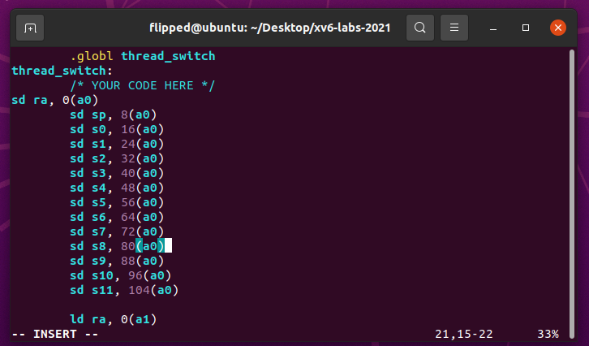
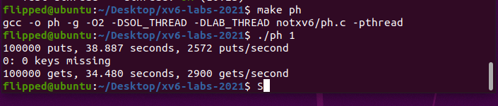

# Uthread: switching between threads

##　1.1 实验目的

用户态进程：设计并实现一个用户级线程系统的上下文切换机制，实现类似于协程的线程切换，而非依赖内核进行调度。需要创建线程、保存/恢复寄存器以在线程之间切换，并且确保解决方案通过测试。

## 1.2 实验步骤

切换到 thread 分支：
```bash
git fetch 
git checkout thread 
make clean
```


1. 需要在`user/uthread.c` 中实现`thread_create()` 和`thread_schedule()` ，并且在 `user/uthread_switch.S` 中实现`thread_switch` 用于切换上下文。


2. 在`uthread.c`中创建适当的数据结构来表示线程。每个线程被定义成一个结构体，一个字节数组用作线程的栈，一个整数用于表示线程的状态：


3. 创建线程:在 `user/uthread.c` 中修改`thread_create()`，将 `ra` 设为我们所要执行的线程的函数地址（`thread_switch` 在保存第一个进程的上下文后会加载第二个进程的上下文， 然后跳至刚刚加载的`ra` 地址处开始执行）：


4. 上下文切换: 在`user/uthread_switch.S`文件中的`thread_switch` 实现线程切换的汇编代码。函数中按照`struct context` 各项在内存中的位置，需要实现保存调用者保存的寄存器，切换到下一个线程，然后恢复下一个线程的寄存器状态。在实现上，可以仿照`kernel/trampoline.S`的写法。



5. 调度线程,切换上下文: 在 `user/uthread.c` 中添加`thread_schedule`函数，调用`thread_switch`来实现线程的切换。需要传递一些参数给`thread_switch`，以便它知道要切换到哪个线程：


6. 利用`make qemu`指令运行`xv6`：

7. 在命令行中输入`uthread`:


8. 在终端里运行 `./grade-lab-thread uthread`  可进行评分：


## 1.3 实验中遇到的问题和解决方法
线程堆栈分配： 在创建线程时，需要为每个线程分配独立的堆栈空间。这里我查阅相关说明和源码，需要利用寄存器各自的功能特性，比如在 `RISC-V` 架构中，寄存器 `ra` 是返回地址寄存器（`Return Address Register`），它存储了函数调用后的返回地址。而寄存器 `sp` 则是栈指针寄存器（`Stack Pointer Register`），它存储了当前栈的顶部地址。因此在`struct`结构体中，我将这两个寄存器包含其中，并在创建线程的时候对其进行的分配。
调度器实现： 实现调度器时，应当确保线程切换的逻辑正确。我希望在调用`thread_switch`时传递正确的参数，但是传递参数时出现了错误，使得程序无法运行，后来我使用 `riscv64-linux-gnu-gdb` 进行单步调试来验证代码的正确性。设置断点、检查寄存器、单步执行汇编指令等帮助我更好地理解和调试代码。

## 1.4 实验心得
首先我更好地理解了寄存器的功能特性。在创建线程时，正确分配线程的堆栈空间是关键。通过理解 `RISC-V` 架构中寄存器的功能特性，我能够选择适当的寄存器来存储必要的信息，比如函数指针和栈顶指针。这样，当线程被调度执行时，它能够正确跳转到函数起始位置，并且在自己的独立栈上执行，避免与其他线程的干扰。

这个实验让我更深入地理解了线程的概念以及线程切换的底层实现机制。通过充分利用寄存器的特性和调试工具，我成功地解决了遇到的问题，并完成了实验任务。


# 2. Using threads

## 2.1 实验目的
本实验旨在通过使用使用 `POSIX` 线程库（`pthread`）实现多线程编程，以及在多线程环境下处理哈希表。学习如何使用线程库创建和管理线程，以及如何通过加锁来实现一个线程安全的哈希表，使用锁来保护共享资源，以确保多线程环境下的正确性和性能。

## 2.2 实验步骤

1. 运行` make ph `编译 `notxv6/ph.c`，运行` ./ph 1`，


​ 写入哈希表的数据被完整地读出，没有遗漏

2. 运行` ./ph 2`

在多线程同时读写的情况下，部分数据由于竞争访问，出现了缺少的键（`missing keys`）问题，即一些数据没有被正确写入到哈希表中。

当两个线程同时向哈希表中添加条目时，它们的总插入速率为每秒 26174次。这大约是运行 `ph 1` 的单线程速度的两倍。约 2 倍的出色 "并行加速" 是我们所期望的（即两倍的内核在单位时间内产生两倍的工作量）。

3. 分析多线程问题：在多线程环境中，出现缺少的键问题可能是由于竞争条件引起的。尝试分析多线程情况下的序列事件，找出可能导致缺少键的情况。


同时有多个线程工作，所以当一个进程往哈希表中填入一个键时，可能有其他进程也希望填入一个键。如果两个键的哈希值不相等，那么插入是没有问题的，两个键都可以成功在不同的哈希筒中出现。但是如果两个键哈希值相同，那么其插入的位置一样，就会导致其中一个（相对后写入的）将另一个新插入的键覆盖，从而导致了键的丢失。

4. 加锁（对于每个哈希筒，每次只允许一个进程访问），保护共享资源，以防止多线程竞争引起的问题：

定义一个保护哈希表的互斥锁：


5. 在`main`函数使用`put`调用`insert`之前，使用`pthread_mutex_init`来初始化锁：


6. 在使用`insert`前后，使用`lock`上锁开锁，保证`insert`操作的原子性：


7. 使用完毕之后，除了释放锁，还需要销毁，防止占用资源：


8. 再使用`make ph` 编译`notxv6/ph.c` ，运行` ./ph 2`


重新测试之后可以发现，`keys missing`在单线程和多线程下都为0。

## 2.3实验中遇到的问题和解决方法
* 死锁： 错误地使用锁可能会导致死锁，即所有线程都在等待锁，无法继续执行。确保在使用锁时遵循正确的获取和释放顺序，以避免死锁情况的发生。同时，在最后尽管已经释放了锁，但是创建了锁会占用一定的资源和内存，这影响了程序的性能，因此我又添加上了`pthread_mutex_destroy`来销毁锁，从而避免在程序中反复创建锁而没有销毁它们，导致最终耗尽系统的资源，使得其他程序或操作受到影响。
* 性能问题： 使用过多的锁可能会导致性能下降，因为锁可能会限制多线程并行执行的能力。我需要考虑如何在不影响正确性的前提下，尽量减少锁的使用，以提高多线程性能。在某些情况下，并发的 `put()s` 在哈希表中读取或写入的内存没有重叠，因此不需要锁来相互保护。因此我可以通过为每个哈希桶添加独立的锁来改进代码，从而提升并行性和性能。这样做的关键是将锁的粒度缩小到最小的冲突范围，避免了不必要的锁竞争。

## 2.4 实验心得
当我参与使用线程进行并行编程的实验时，我深刻地了解到了多线程编程的挑战和重要性。本次实验涉及了使用线程和锁来实现一个哈希表，并探索了在多线程环境下的表现。我明白了锁在多线程环境中的关键作用。使用锁可以确保在访问共享资源时的线程安全性，防止竞争条件和数据不一致的问题。我学会了如何使用 `pthread_mutex_t` 类型的锁，并且确保在使用锁时始终遵循正确的获取和释放顺序，以避免死锁情况的发生。此外，我还了解到在锁的创建和销毁方面需要注意性能问题，因为未销毁的锁可能会影响系统的资源和性能。

其次，我在优化并发性能方面获得了一些见解。我意识到过多的锁可能会导致性能下降，因此需要在保证正确性的前提下尽量减少锁的使用。特别是，我学会了如何将锁的粒度缩小，以便最大程度地减少锁竞争，从而提高并行性和性能。我在实验中发现，为每个哈希桶添加独立的锁是一个有效的优化方法，可以显著提升多线程执行的效率。

# 3. Barrier
## 3.1 实验目的
本实验旨在通过实现一个线程屏障（`barrier`），即每个线程都要在 `barrier` 处等待，直到所有线程到达 `barrier` 之后才能继续运行，加深对多线程编程中同步和互斥机制的理解。在多线程应用中，线程屏障可以用来确保多个线程在达到某一点后都等待，直到所有其他参与的线程也达到该点。通过使用`pthread`条件变量，我们将学习如何实现线程屏障，解决竞争条件和同步问题。

## 3.2 实验步骤
1. 熟悉`struct barrier`结构体的成员变量。

通过比较` bstate.nthread `与全局变量 `nthread`，可以分别判断是否使进程等待或者唤醒其他进程。

库函数` pthread_cond_wait(&cond, &mutex)`; 使进程释放`mutex `锁并进入睡眠，等待 `cond` 将其唤醒。`pthread_cond_broadcast(&cond);` 将所有等待` cond `的进程唤醒。

2. 在`barrier.c`中的`barrier()`函数中添加逻辑。在某个线程到达 `barrier()` 时，需要获取互斥锁进而修改 `nthread`。当` nthread `与预定的值相等时，将 `nthread `清零，轮数加一，并唤醒所有等待中的线程。


使用`pthread_cond_wait()`来等待条件满足，`pthread_cond_broadcast()`来唤醒等待的线程。

* 在这个函数中，`bstate.nthread` 表示当前已经达到屏障的线程数量。当一个线程进入屏障时，会将这个计数值加一，以记录达到屏障的线程数量。
* 如果还有线程未达到屏障，这个线程就会调用 `pthread_cond_wait()` 来等待在条件变量 `barrier_cond 上。在调用这个函数之前，线程会释放之前获取的锁 barrier_mutex`，以允许其他线程在这个锁上等待。
* 当最后一个线程到达屏障，`bstate.nthread` 的值会等于 `nthread`，就会进入 `else` 分支。在这里，首先重置 `bstate.nthread` 为 0，以便下一轮的屏障计数。然后，增加 `bstate.round` 表示进入了下一个屏障的轮次。最后，通过调用` pthread_cond_broadcast() `向所有在条件变量上等待的线程发出信号，表示可以继续执行。

3. 保存后在终端里执行`make barrier` 编译`notxv6/barrier.c `，运行`./barrier 2`：


## 3.3 实验中遇到的问题和解决方法
* 竞争条件问题： 由于多线程环境中存在竞争条件，所以需要使用互斥锁来保护共享资源的访问。在更新`bstate.nthread`等共享变量时，我发现这同样需要使用互斥锁进行保护，否则多个线程可能会同时修改变量的值，从而导致不确定的行为和错误的结果。

* `pthread_cond_wait`与`pthread_cond_broadcast`的配合使用：

在实验指导中提示了这两个函数的使用，但是要如何适用、如何配合来实现`barrier`函数功能？首先，当一个线程需要等待某个条件满足时，它可以调用`pthread_cond_wait`函数，这会导致线程进入等待状态，同时释放它持有的互斥锁。线程在等待期间会一直阻塞，直到其他线程调用`pthread_cond_broadcast`来唤醒它。所以要使用这两个函数，可以按照下面这种模式：

* 所有线程在某个共享资源或条件未满足的情况下，都调用`pthread_cond_wait`来等待。这个等待会自动释放互斥锁，让其他线程可以访问共享资源。
* 当某个线程改变了共享资源或条件，使得其他线程可以继续执行时，它调用`pthread_cond_broadcast`来通知其他线程。这些线程会被唤醒，重新尝试获取互斥锁，然后继续执行。

## 3.4 实验心得
通过本次实验，我深入了解了多线程编程中的同步机制，特别是条件变量和互斥锁的使用。我学会了如何设计和实现屏障同步，以保证多个线程在特定点同步等待和唤醒，从而实现了程序的并发控制。这次实验不仅提高了我对多线程编程的理解，还让我熟悉了实际使用条件变量和互斥锁解决并发问题的过程。

# 4 实验检验得分

