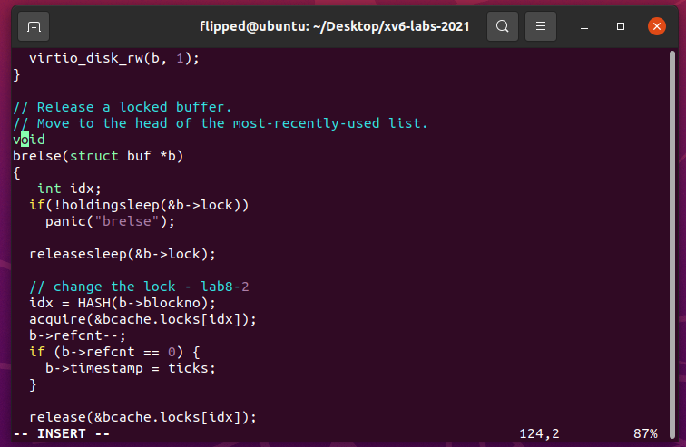
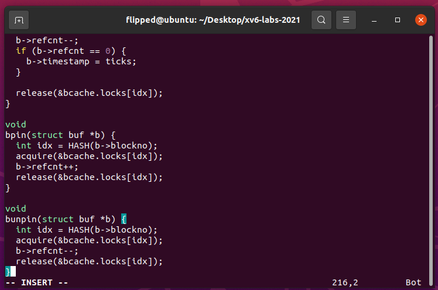

# 1. Memory allocator

##　1.1 实验目的

通过修改内存分配器的设计，以减少锁竞争，从而提高多核系统中的性能。具体来说，需要实现每个`CPU`都有一个独立的自由列表（`free list`），每个列表都有自己的锁。这样可以让不同`CPU`上的内存分配和释放操作可以并行进行，从而减少锁的争用。还需要实现当一个`CPU`的自由列表为空时，能够从其他`CPU`的自由列表中获取部分内存。

## 1.2 实验步骤

切换到 lock 分支：
```bash
git fetch 
git checkout lock 
make clean
```


原先只有一个`freelist`，一个`lock`给八个`cpu`竞争使用，需要重新设计为八个`freelist`、八个`lock`给八个`cpu`使用。按照要求，一个 `CPU` 的空闲链表为空时，需要向别的 `CPU`“借”一些空间以保证所有空间都能正常分配。

1. 在实验开始之前，运行 `kalloctest` 测试：


用户态程序 `kalloctest` 产生三个进程，这些进程会不断分配并释放内存，使得原始的 `xv6` 中的只有一个空闲链表的数据结构的锁被不断获取和释放，且大多数时候对锁的 `acquire()` 会被阻塞。

`test1` 的结果：

锁 `kmem` 的测试中，有大量的 `#test-and-set` 和 `#acquire()` 操作，这意味着在尝试获取这个锁时，很多次需要重新尝试（`test-and-set` 是一种获取锁的方式，`acquire` 是另一种方式）。
锁 `proc` 也有大量的 `#test-and-set` 和 `#acquire()` 操作，这也可能是导致问题的原因之一。
从输出来看，问题主要集中在` kmem `和 `proc` 这两个锁上，出现了大量的锁竞争和争用情况。因此这是实验中所要解决的问题：减少锁争用，提高内存分配器的性能。

2. 在实验代码中找到内存分配器相关的部分，`NCPU `在 `param.h` 中声明，值为 8。


将`kalloc.c` 中`kmem`修改成数组形式结构体，每个`CPU`分配一个`keme`锁：


3. 修改 `kinit()` 函数： 初始化每个 `CPU` 的空闲链表和锁，使用循环设置每个锁的名称，以及调用 `initlock` 初始化锁。


4. 修改 `kfree()` 函数： 释放内存页时，根据当前 `CPU` 核心获取对应的锁，确保每个 `CPU` 的空闲链表正确维护。


5. 修改 `kalloc()` 函数： 在分配内存页时，先尝试从本地 `CPU `的空闲链表获取，如果为空则调用` steal() `函数偷取其他 `CPU` 的一半空闲内存页。


6. 编写 `steal()` 函数： 该函数用于从其他 `CPU` 偷取部分空闲内存页，保证正确的锁使用和避免死锁。


7. 利用`make qemu`指令运行`xv6`：

8. 在命令行中输入`kalloctest`:


9. 在 `test1` 中，可以看到 `acquire` 的循环迭代次数明显减少，表明锁的争用较之前有所减少，每个` CPU` 现在有了自己的 `freelist`，减少了 `CPU` 之间在访问内存分配器时的竞争。

10. 运行 `usertests sbrkmuch` 测试，确保内存分配器仍然能够正确分配所有内存。


11. 运行 `usertests` 测试，确保所有的用户测试都通过。


## 1.3 实验中遇到的问题和解决方法
* 原子性问题：在实现过程中，需要确保每次获取锁和释放锁的顺序是一致的，避免出现循环等待的情况。除此之外，一开始我在读取CPU的ID时没有禁用中断，使得程序出错，这很有可能是多个核心同时访问共享资源而没有正确的同步机制，也许会导致竞争、数据损坏、不一致性或不可预测的结果。于是我查阅资料后，加上了 `push_off()` 和 `pop_off()` 来禁用和启用中断，这保证了我读取`CPU` `ID`的准确性和可靠性。
* 性能问题：虽然目标是减少锁的争用，但是在借用页面的问题上，究竟以多少页为限制是一个比较好的选择，这也许需要进一步的实际验证来决定，在本次实验中，我选择了1024，1024 页面的选择可能是因为这个数量可以覆盖一定的范围，同时避免了一次性偷取过多导致的长时间的锁竞争。然而实际上可以根据具体的硬件架构、应用负载和性能需求进行调整。
## 1.4 实验心得
当我开始进行实验时，我对于操作系统内核的设计和锁竞争问题并没有太多的了解。然而，通过完成这个实验，我逐渐理解了操作系统内核的基本结构以及如何解决多核心环境下的锁竞争问题。在多核心环境下，锁的使用是解决并发访问问题的关键。在实验中，我学会了如何使用 `acquire` 和 `release` 函数来保护共享资源，以避免竞争条件和数据不一致问题。

同时，通过前后 `kalloctest` 实验对比，我意识到锁竞争可能会对系统性能产生显著影响。通过使用 `per-CPU freelist` 和借用页面的方式，我成功地减少了锁竞争，从而提高了内核的性能。

# 2. Buffer cache

## 2.1 实验目的
优化`xv6`操作系统中的缓冲区缓存（`buffer cache`），减少多个进程之间对缓冲区缓存锁的争用，从而提高系统的性能和并发能力。通过设计和实现一种更加高效的缓冲区管理机制，使得不同进程可以更有效地使用和管理缓冲区，减少锁竞争和性能瓶颈。


## 2.2 实验步骤
原始的 `xv6` 中，对于缓存的读写是由单一的锁 `bcache.lock` 来保护的，导致了如果系统中有多个进程在进行`IO` 操作，则等待获取 `bcache.lock` 的开销就会较大。为了减少加锁的开销，可以将缓存分为几个桶，为每个桶单独设置一个锁，这样如果两个进程访问的缓存块在不同的桶中，则可以同时获得两个锁进行操作，而无需等待加锁。目标是将`bcachetest` 中统计值tot 降到规定值以下。

1. 运行`bcachetest`测试程序，观察锁竞争情况和测试结果


测试结果表明，在多个进程之间，对`bcache.lock`锁的竞争比较激烈，导致多个进程在试图获取该锁时需要进行较多次的`test-and-set`操作和`acquire()`操作。这说明了缓冲区管理中存在较大的竞争问题，可能影响了系统的性能和响应速度。

2. 重新设计和实现缓冲区管理机制，修改`buf`和 `bcache` 结构体，为每个缓冲区添加时间戳字段，为 `bcache` 添加哈希表的锁。


定义`NBUCKET`表示管理的`bucket`个数，并且定义`hash`映射（磁盘块号`blockno`到`bucket`号）

`bcache`结构体中加入`buckets`（`buffer cache`的管理单位，将一堆`buf`数组组织在一起成为`bucket`）以及 `locks `作为每个`bucket`的互斥锁


`struct spinlock lock`是自旋锁，用于保护对该分桶的并发访问。当有线程要操作这个分桶时，需要先获取这个锁。
`struct buf buf[NBUF]`数组的每个元素代表一个缓冲区。缓冲区结构体 `struct buf` 存储了实际的数据内容、元数据和与缓冲区相关的控制信息。

3. 修改初始化函数： 在 `binit()` 函数中初始化哈希表的锁和缓冲区的时间戳字段。


4. 修改 `brelse()` 函数： 释放缓冲区时，更新时间戳字段，根据时间戳来选择缓冲区进行重用。



5. 修改分配函数： 在 `bget()` 函数中，使用哈希表来寻找对应的缓冲区，若未找到则根据时间戳和引用计数来选择缓冲区进行覆盖重用。


6. 加入两个维护`block`的`refcnt`的函数：



9. 运行`make qemu` ,`bcachetest`


比较实验开始前和实验进行后的测试结果，可以看出锁竞争明显减少，在实验进行之前的测试中，锁竞争非常严重。`bcachetest` 测试中显示了大量的 `test-and-set` 操作和锁的获取次数，这表明在并发访问缓冲区池时存在大量的竞争。而最新测试结果中，锁竞争明显减少，`test-and-set` 操作和锁的获取次数较少。

## 2.3 实验中遇到的问题和解决办法
* 问题：缓冲区管理效率低下： 原始的缓冲区管理方式使用链表结构，重用缓冲区时效率低下。
* 解决办法： 使用哈希表和时间戳： 引入线程安全的哈希表来管理缓冲区，使用时间戳字段来实现基于时间的 LRU 算法。这样可以更高效地管理缓冲区，提高文件 I/O 操作的性能。
* 问题： 在修改缓冲区管理代码时，可能会遇到并发情况下的数据一致性问题，如资源分配冲突、竞争条件。
* 解决办法： 增加了锁，根据缓冲区的块号计算哈希索引 v，获取对应的分桶结构体指针 bucket和分桶的自旋锁，以确保在操作缓冲区引用计数时不会被其他线程干扰。

## 2.4 实验心得

在开始实验之前，我深入理解了 `Buffer Cache` 的结构，包括缓存的大小、缓存块的管理方式以及数据结构等。这为我后续的编码和设计提供了重要的指导。

实验要求的功能涵盖了从缓存的获取、写入到缓存的释放等多个方面。我将实验任务分成不同的阶段，逐步实现和测试每个功能。这样有助于确保每个功能都能够独立正常运行。

在多线程环境下，缓存的并发访问可能导致竞态条件等问题。我使用了适当的同步机制，如自旋锁和信号量，以确保缓存的安全性和一致性。

此外，我注意到了这次设计的内核还包含了`LRU`（最近最少使用）算法，在`Buffer Cache`中，`LRU`算法用于确定哪个缓存块应该被释放，以便为新的数据块腾出空间。`LRU`算法的核心思想是，最近最少使用的缓存块应该被优先释放，因为它们更有可能在未来不会被再次访问。而在结构体的设计上，`struct bucket` 结构体包含一个锁` lock` 和一个链表头` head`。链表头 `head` 表示了一个双向循环链表，用于存储缓存块。这个链表是按照缓存块被使用的时间顺序来排序的，即最近被使用的缓存块位于链表头部，最少使用的位于链表尾部。这正是`LRU`算法的核心思想。

#  实验检验得分


