# 1. Large files 

[项目链接:https://github.com/jaychou729/2024OS-xv6](https://github.com/jaychou729/2024OS-xv6)
##　1.1 实验目的

本次实验的目的是扩展 `xv6` 文件系统，实现双层映射的机制，使其支持更大的文件大小。

原始的`xv6` 的实现中，其文件系统使用基于`inode` 和目录的文件管理方式，但其 `inode` 仅为两级索引，共有 12 个直接索引块和 1 个间接索引块，间接索引块可以指向 256 个数据块，故而一个文件最多拥有 268 个数据块，或 268 * `BSIZE` 字节（在 `xv6` 中，`BSIZE` 为 1024）。

可以改经为使用三级索引，共有 11 个直接索引，1 个间接索引块和 1 个二级间接索引块，故总共支持文件大小为 11 + 256 + 256 × 256 = 65803 块。

## 1.2 实验步骤

切换到 `fs` 分支：

```bash
git fetch 
git checkout fs 
make clean
```

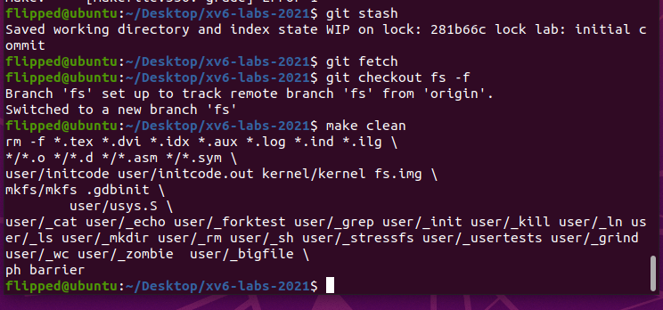
1. 打开 `kernel/fs.h` 中，查找 `NDIRECT` 和 `NINDIRECT` 的定义。这些常量表示直接块和单间接块的数量。

原先 `xv6` 的 `inode` 包含 12 个直接数据块号`NDIRECT`和 1 个间接数据块号`NINDIRECT`，其中间接数据块包含 256 个块号（`BSIZE / sizeof(uint)`），因此一个 `xv6` 的文件最多只能含有 268 个数据块的数据。

修改宏定义，将单层映射改为双层映射，以支持更大的文件大小：

将一个直接数据块号替换成一个两层间接数据块号，即指向一个包含间接数据块号的数据块，这样使每个 `inode` 都支持一个 "双向 "块，其中包含 256 个单向块地址，每个单向块最多可包含 256 个数据块地址。这样，一个文件最多可以包含 65803 个数据块，即 256*256+256+11 个数据块（11 个而不是 12 个，因为还需要牺牲一个直接数据块的编号来使用双向数据块）

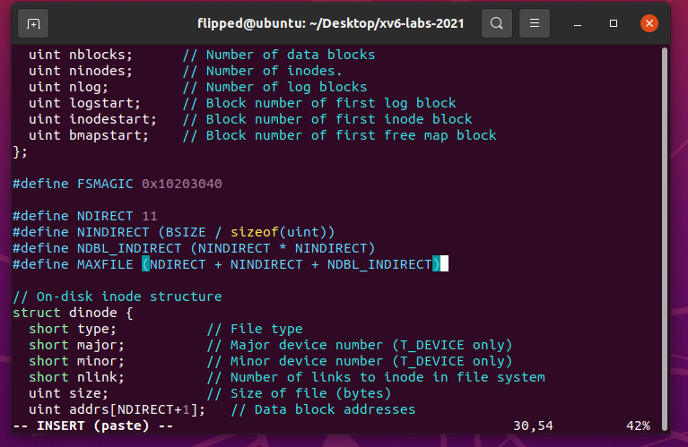

`NDBL_INDIRECT` 宏，表示双间接块能够存储的块号数量，即单间接块的数量的平方（256 * 256）

2. 在` kernel/file.h `中更新文件的 `struct inode` 数据结构，在 `kernel/fs.h` 中更新文件的 `struct dinode` 数据结构，修改 `addrs[]` 数组的大小以支持双间接块。

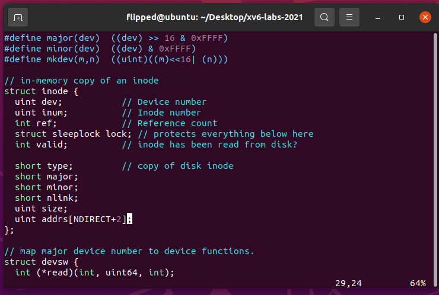

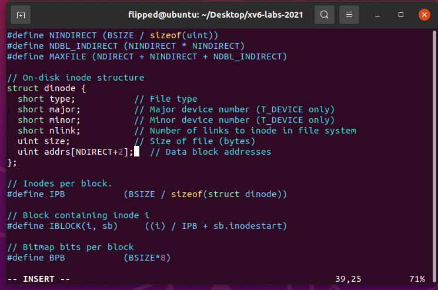

在 `struct inode` 中，`addrs` 数组用于存储直接块、单间接块和现在新增的双间接块的块号。

3. 在 `kernel/fs.c` 的 `bmap` 函数(负责将文件的逻辑块号映射到磁盘块号)中，添加双层间接映射的逻辑。

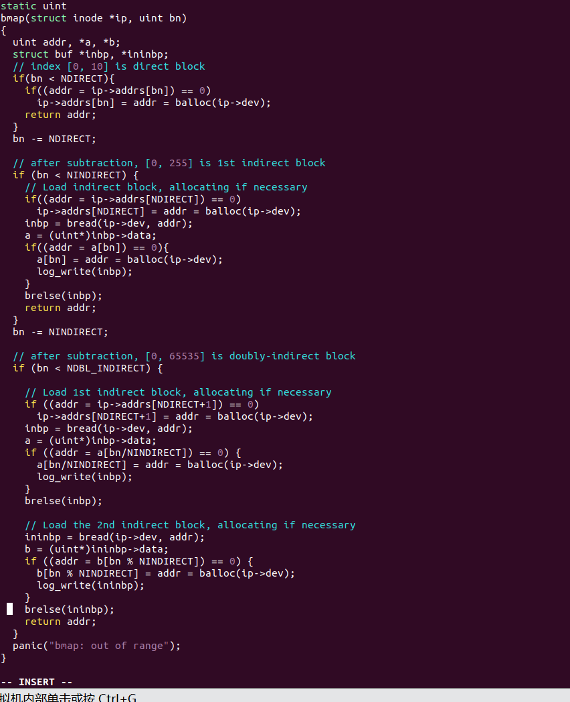

当文件系统需要访问一个块号 `bn` 对应的数据块时，`bmap()` 函数被用来将逻辑块号映射到实际的磁盘块号。这段新增的代码处理了对于超过单间接块限制的块号，即 `bn` 大于等于 `NINDIRECT` 时。

4. 在 `kernel/fs.c` 的 `itrunc` 函数中，添加对双层间接映射的清除逻辑，确保释放双层映射的数据块。

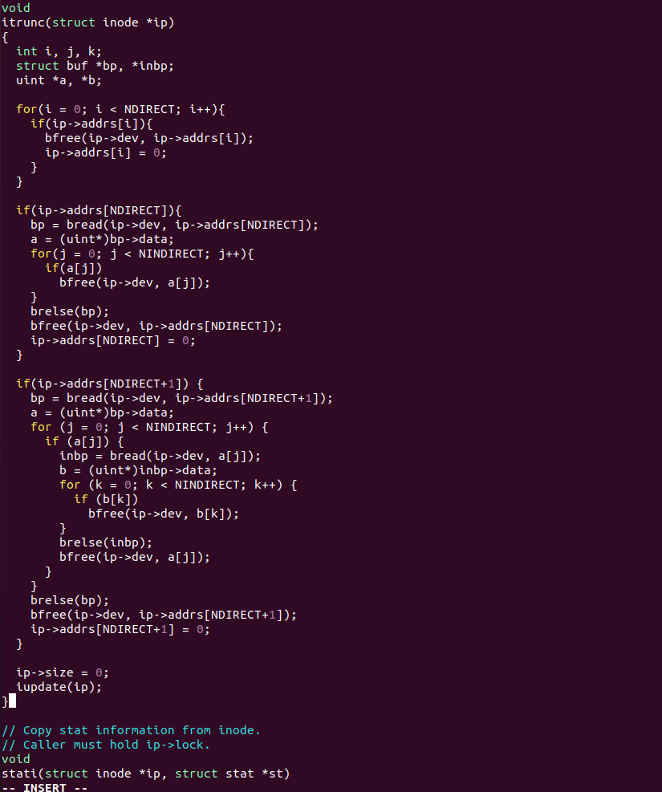

5. 利用`make qemu`指令运行`xv6`：

6. 在命令行中输入`bigfile`:

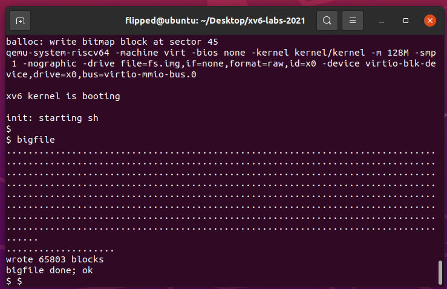

## 1.3 实验中遇到的问题和解决方法
实验中最大的问题在于要理清楚各种数据块号之间的关系。

首先要理解`xv6`文件系统是使用`inode`来管理文件，下面这张图可以很好解释文件的`inode`是怎么管理它的磁盘块的：

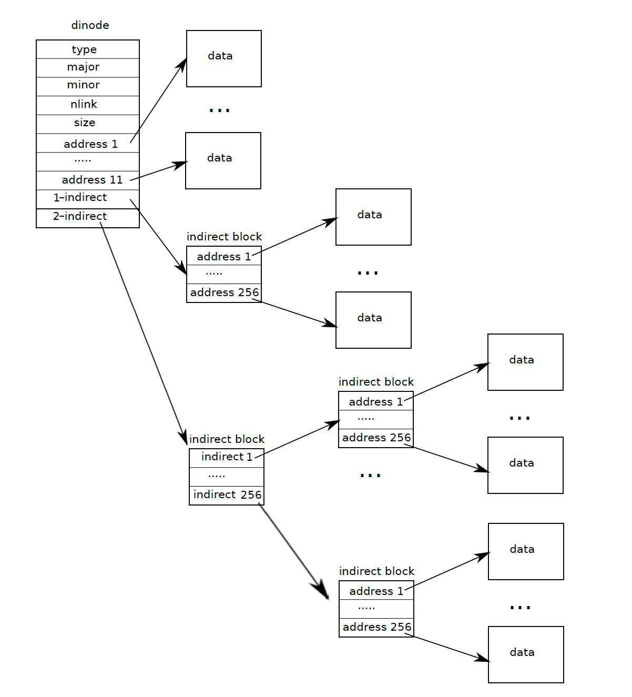
根据上图，我们便可以顺利修改宏定义，创造出新的二级索引，扩大可存储量。

要注意，我不能只修改`bmap`函数，而是还需要同步修改`itrunc()` ，使得其在丢弃 `inode` 的时候回收所有的数据块。由于添加了二级间接块的结构，因此也需要添加对该部分的块的释放的代码。释放的方式同一级间接块号的结构，只需要两重循环去分别遍历二级间接块以及其中的一级间接块。

实验心得
在本次实验中，我们成功地扩展了 `xv6` 文件的最大大小。初始的 `xv6` 文件系统限制了文件的最大大小为 268 个块，或者 268 `BSIZE` 字节（其中 `BSIZE` 在 `xv6` 中为 1024）。我通过实现双间接块的概念，成功将文件的最大大小扩展到了 65803 个块（或者 256*256+256+11 个块）。

阅读并理解原始代码时，我最初的难点是理解 `xv6` 文件系统的数据结构，包括 `inode` 结构、块地址数组等。通过阅读代码注释、文档并且查阅相关资料，我逐步理解了这些概念。并且参照上面的`inode`结构图，准确修改了文件系统宏定义，且在`bmap`上实现顺序映射逻辑块号到磁盘块号，在`itrunc`上实现逆序地释放块。通过完成本次实验，我更加地深入理解了 `xv6` 文件系统的内部结构和工作原理。

# 2. Symbolic links

## 实验目的

本次实验的主要目的是在 `xv6` 操作系统中实现符号链接（软链接）的功能。符号链接是一种通过路径名来引用另一个文件的方式，与硬链接不同，符号链接可以跨越不同的磁盘设备。通过实现这个系统调用，我们将深入理解路径名查找的工作原理。

## 2.2 实验步骤
符号链接就是在文件中保存指向文件的路径名，在打开文件的时候根据保存的路径名再去查找实际文件。`symlink`的系统调用就是创建一个`inode`，设置类型为`T_SYMLINK`，然后向这个`inode`中写入目标文件的路径。

1. 创建系统调用：添加有关 `symlink` 系统调用的定义声明

`kernel/syscall.h`：

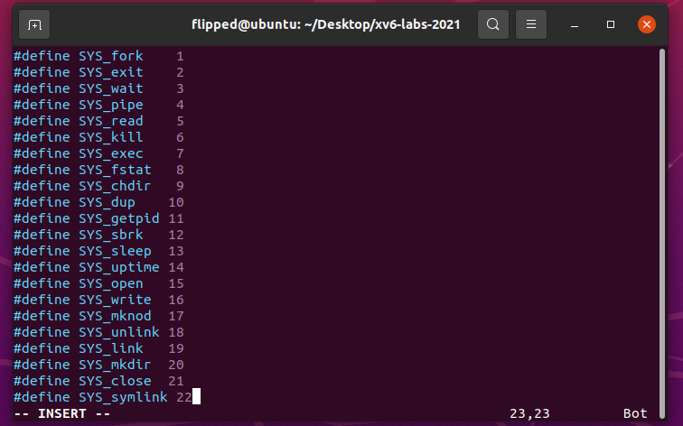

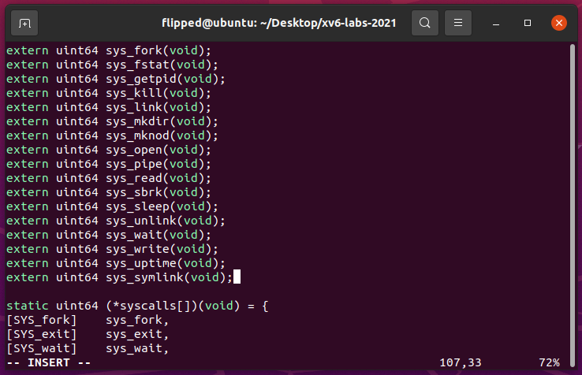

`kernel/syscall.c`：

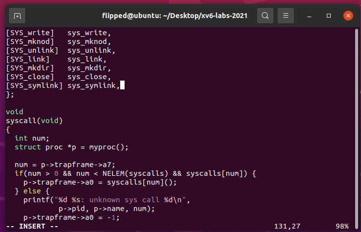

`user/usys.pl` ：

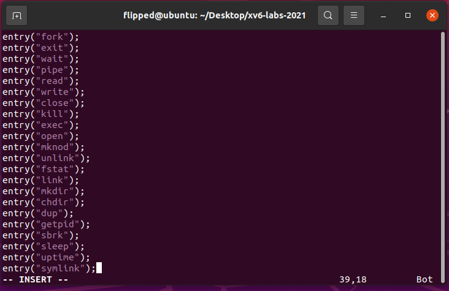

`user/user.h`：

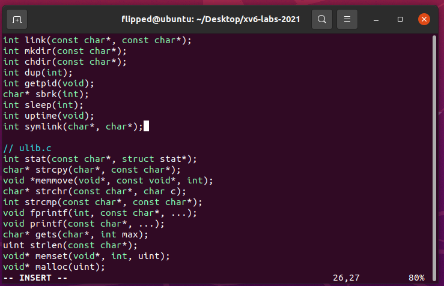

2. 在 `kernel/stat.h` 中添加一个新的文件类型 `T_SYMLINK`，用于表示符号链接。这将帮助区分普通文件和符号链接。

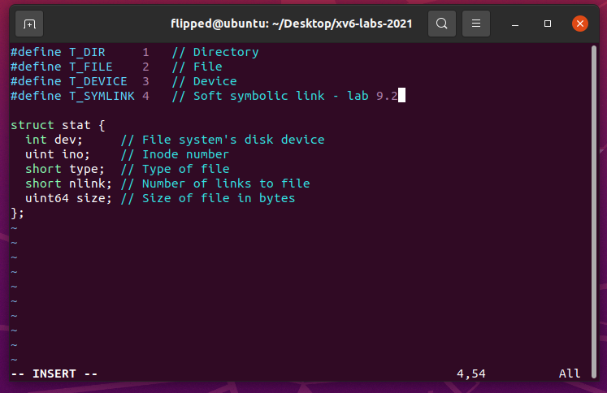

3. 在 `kernel/fcntl.h` 中添加一个新的打开标志 `O_NOFOLLOW`，该标志可以与 `open` 系统调用一起使用。

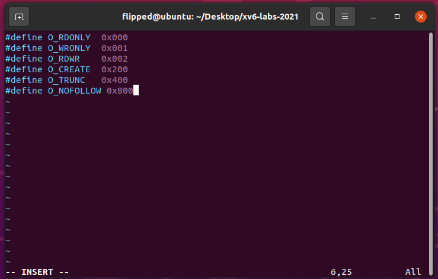

4. 在 `kernel/sysfile.c` 中实现 `sys_symlink` 系统调用，将目标路径写入新创建的符号链接文件的数据块中。

函数先通过 `create()` 创建符号链接路径对应的 `inode` 结构（同时使用 `T_SYMLINK` 与普通的文件进行区分）。然后通过 `writei()` 将链接的目标文件的路径写入 `inode` 的 `block` 中即可。在这个过程中，无需判断连接的目标路径是否有效。

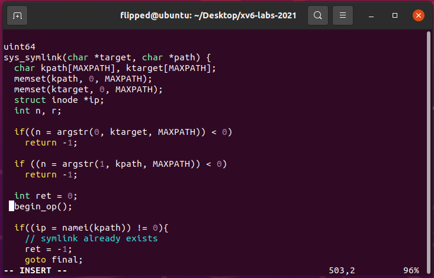

函数 `create()` 会返回创建的 `inode`，此时也会持有其 `inode` 的锁。而后续 `writei()` 是需要在持锁的情况下才能写入。在结束操作后（不论成功与否），都需要调用 `iunlockput()` 来释放 `inode` 的锁和其本身，该函数是 `iunlock()` 和 `iput()` 的组合，前者即释放 `inode` 的锁，而后者是减少一个 `inode` 的引用（对应字段 `ref`, 记录内存中指向该 `inode` 的指针数，这里的 `inode` 实际上是内存中的 `inode`, 是从内存的 `inode` 缓存 `icache` 分配出来的, 当 `ref` 为 0 时就会回收到 `icache` 中），表示当前已经不需要持有该 `inode` 的指针对其继续操作了。

5. 修改 `open` 系统调用，以处理路径引用到符号链接的情况。如果文件不存在，`open` 应该失败。当进程在 `flags` 中指定了 `O_NOFOLLOW` 时，`open` 应该打开符号链接而不是跟随链接。

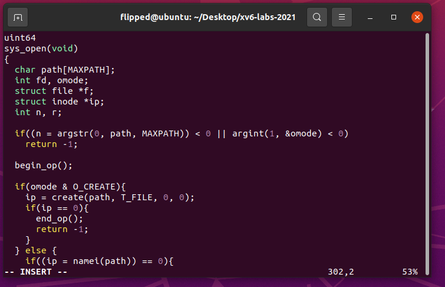

如果指定的文件是符号链接且没有设置 `O_NOFOLLOW`，读取符号链接的目标路径，递归解析目标路径，打开文件并返回文件描述符。

6. 在 `Makefile` 中添加对测试文件 `symlinktest.c` 的编译

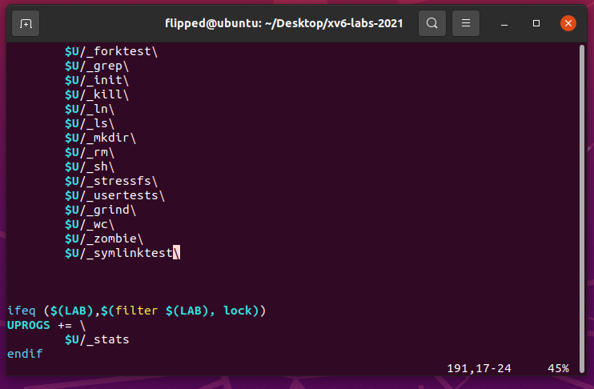

7. 保存后在终端里执行`make qemu`，运行`symlinktest`

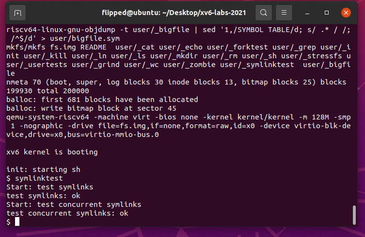

## 2.3 实验中遇到的问题和解决方法
需要注意添加的函数之间的顺序，防止出现未声明先使用这样的错误。
在处理符号链接时，需要通过适当的加锁和释放规则，确保对不同 `inode` 的正确操作和同步。还需要注意有隐性的一些条件，比如：在 `sys_open()` 中处理`symlink`的代码处，不用调用`iunlockput()`释放锁，因为`follow_symlinktest()`返回失败时,锁在函数内已经被释放。

## 2.4 实验心得
在本次实验中，我成功地向 `xv6` 操作系统添加了符号链接（软链接）的支持。符号链接是一种特殊类型的文件，可以跨越磁盘设备引用其他文件。在这个实验中，我实现了 `symlink(char *target, char *path)` 系统调用，该调用可以创建一个新的符号链接文件，将其指向目标文件。此外，为了防止符号链接文件溯源的过程中陷入死循环，我们还额外考虑了循环的深度限制和成环检测，这提高了我们的效率，并且保障了程序的安全性。

# 实验检验得分

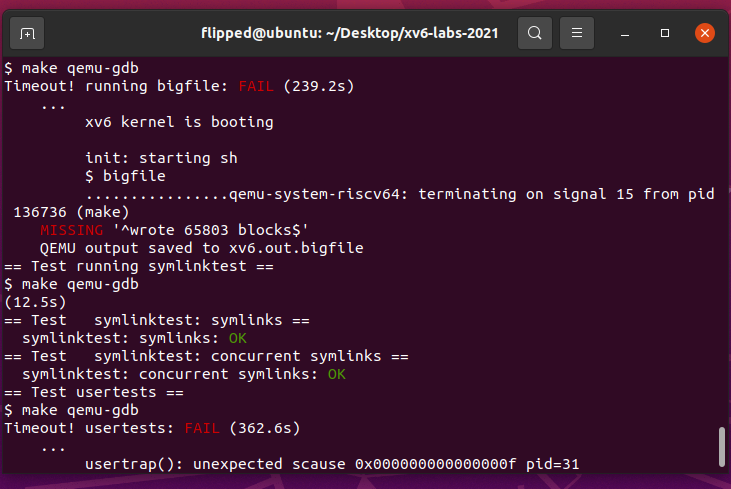

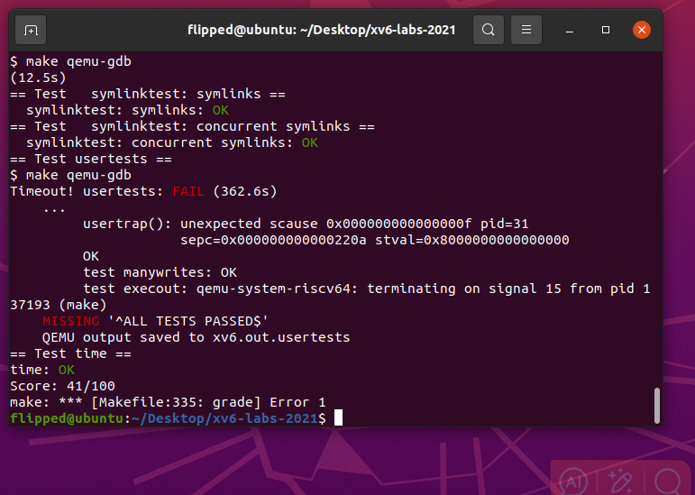
